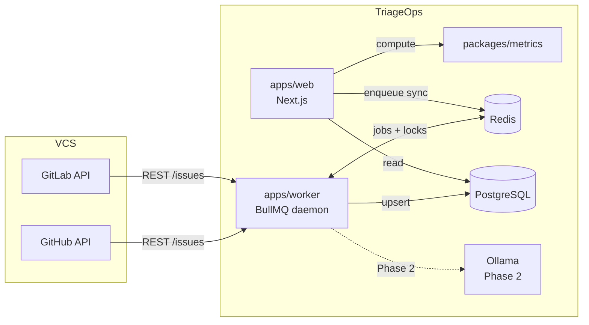

# Architecture

## System overview

TriageOps follows a **sync-and-analyze** pattern: a background worker pulls issue data from GitHub or GitLab into Postgres; the web app reads that local data to compute and display triage metrics without hammering the VCS API on every page load.



> **Security:** Auth is disabled by default locally (`AUTH_DISABLED=true`). Set `AUTH_DISABLED=false` and configure OAuth before exposing the app to a network. See [Authentication](./running-the-app.md#authentication).

---

## Monorepo packages

### `apps/web` — Dashboard (Next.js)

**Role:** User-facing UI and API routes.

| Concern | Technology |
|---------|------------|
| Framework | Next.js 16 App Router |
| Styling | Tailwind CSS v4 + Shadcn UI |
| Data access | `@triage-ops/db` (Prisma) |
| Metrics | `@triage-ops/metrics` |
| Job enqueue | BullMQ `Queue` via `lib/queue.ts` |
| Deployment | Standalone Docker image on port 3000 |

**Responsibilities:**
- Display overview counts and triage metrics (ghost, zombie, milestone decay)
- Manage VCS connections (GitHub or GitLab) and registered projects
- Trigger sync jobs by enqueueing to BullMQ via Redis

**Key paths:**

| Path | Purpose |
|------|---------|
| `app/(dashboard)/` | Dashboard, connections, projects pages |
| `app/api/` | REST API routes |
| `components/` | Shadcn UI components, layout shell |
| `lib/services/` | `projects.ts`, `metrics.ts` — server-side data helpers |
| `lib/queue.ts` | BullMQ enqueue helper |

---

### `apps/worker` — Background daemon

**Role:** Long-running Node process that consumes BullMQ jobs.

| Module | Path | Purpose |
|--------|------|---------|
| Entry point | `src/index.ts` | Starts BullMQ worker, handles graceful shutdown |
| GitLab client | `src/lib/gitlab/client.ts` | Paginated fetch of project issues via GitLab REST API |
| GitHub client | `src/lib/github/client.ts` | Paginated fetch via GitHub REST API |
| VCS router | `src/lib/vcs/fetch-project-issues.ts` | Dispatches by `VcsProvider` |
| Redis locks | `src/lib/lock.ts` | Distributed lock per project (`SET NX` + token-safe release) |
| Sync queue | `src/queues/sync-queue.ts` | Queue factory and connection config |
| Sync processor | `src/workers/sync-worker.ts` | Job handler: fetch → upsert issues + milestones → update `SyncRun` |
| Config | `src/config/env.ts` | Required env var validation |

**Job flow (`gitlab-sync` queue):**

1. Job received with payload `{ projectId, syncRunId }`
2. Acquire Redis lock for `sync:{projectId}` (skip if already locked)
3. Mark `SyncRun` as `RUNNING`
4. Load `Project` + `VcsConnection` from Postgres
5. Route to GitHub or GitLab client based on `connection.provider`
6. Paginate issues (100 per page)
7. Upsert each issue; upsert linked milestones (title, due date, state)
8. Mark `SyncRun` as `COMPLETED` (or `FAILED` on error)
9. Release lock

**Retry policy:** 3 attempts, exponential backoff starting at 5 s.

---

### `packages/db` — Data layer

**Role:** Single Postgres access point for the entire monorepo.

| Asset | Path |
|-------|------|
| Schema | `prisma/schema.prisma` |
| Migrations | `prisma/migrations/` |
| Seed | `src/seed.ts` |
| Client | `src/client.ts` (singleton, loads root `.env`) |
| Public API | `src/index.ts` |

**Design constraints enforced in schema:**

- One project per connection: `@@unique([connectionId, pathWithNamespace])`
- One issue per project IID: `@@unique([projectId, gitlabIssueIid])`
- External VCS issue ID stored as `BigInt` (`gitlabIssueId`) for GitHub global IDs
- Cascade deletes from connection → project → issues
- Indexes on `Issue.state`, `Issue.lastActivityAt` for metric queries

**Scripts:**

```bash
npm run db:generate -w @triage-ops/db   # Regenerate Prisma client
npm run db:migrate -w @triage-ops/db    # Dev migration
npm run db:migrate:deploy -w @triage-ops/db  # Production deploy
npm run db:seed -w @triage-ops/db       # Sample connections + projects
```

---

### `packages/metrics` — Triage metric engine

**Role:** Pure functions for computing triage signals from synced issue/milestone data. No I/O, no framework dependencies.

| Function | Definition |
|----------|------------|
| `countGhostIssues` | Open issues with `lastActivityAt` older than threshold (default 30 days) |
| `countZombieIssues` | Open + assigned issues stale beyond threshold (default 14 days) |
| `getMilestoneDecay` | Active milestones past `dueDate` with open issues attached |

Used by `apps/web/lib/services/metrics.ts` and exposed via `GET /api/projects/[id]/metrics`.

---

### `packages/shared-types` — Cross-package contracts

**Role:** Types and constants shared between worker and web without circular dependencies.

Exports:
- `QUEUE_NAMES.GITLAB_SYNC`
- `SyncJobPayload`
- `GitLabIssueRaw`, `GitLabIssuesPage`, `FetchGitLabIssuesParams`
- `GitHubIssueRaw`, `GitHubIssuesPage`, `FetchGitHubIssuesParams`
- `NormalizedIssue` — provider-agnostic issue shape after normalization

---

## Infrastructure services

| Service | Image | Host port | Profile | Purpose |
|---------|-------|-----------|---------|---------|
| `postgres` | `postgres:16-alpine` | **5433** | default | Primary datastore |
| `redis` | `redis:7-alpine` | 6379 | default | BullMQ job queue + distributed locks |
| `ollama` | `ollama/ollama:latest` | 11434 | default | Local LLM inference (Phase 2) |
| `web` | Built from `apps/web/Dockerfile` | 3000 | `production` | Production web server |
| `worker` | Built from `apps/worker/Dockerfile` | — | `production` | Production worker daemon |
| `migrate` | `packages/db` | — | `migrate` | One-shot migration runner |

> **Note:** Postgres is mapped to host port **5433** (not 5432) to avoid conflicts with a locally installed Postgres instance.

**Docker profiles:**
- `npm run docker:up` — infra only (postgres, redis, ollama) for local dev
- `npm run docker:up:all` — infra + web + worker (`production` profile)
- `npm run docker:migrate` — apply migrations in container

---

## Authentication

OAuth login via **Auth.js v5** with HTTP-only session cookies (Prisma adapter). Disabled by default for local dev (`AUTH_DISABLED=true`).

| Concern | Implementation |
|---------|----------------|
| Providers | GitHub and/or GitLab OAuth (`AUTH_PROVIDERS`) |
| Route protection | `proxy.ts` + `requireApiSession()` in API handlers |
| On-prem profile | `AUTH_PROVIDERS=gitlab`, `AUTH_DATA_SCOPE=shared`, email/domain allowlist |
| Hosted profile | `AUTH_PROVIDERS=github`, `AUTH_DATA_SCOPE=per_user` |
| Data ownership | `VcsConnection.userId` — filtered when `per_user`, shared when `shared` |
| Login page | `/login` with provider buttons |
| VCS sync tokens | Separate from login OAuth — users still add PATs per connection |

See [Running the App](./running-the-app.md) for OAuth app setup and env vars.

---

## Testing architecture

- **Framework:** Vitest (TypeScript-native, fast)
- **HTTP mocking:** MSW (Mock Service Worker) — no real network calls in unit tests
- **Locations:**
  - `apps/worker/src/**/*.test.ts` — VCS clients, locks, sync helpers (35 tests)
  - `packages/metrics/src/**/*.test.ts` — metric functions (17 tests)
  - `apps/web/lib/**/*.test.ts` — API validation + auth helpers
- **TDD rule:** Write test contract before implementing core utilities

See [Development Guide](./development-guide.md) for the full TDD checklist.
