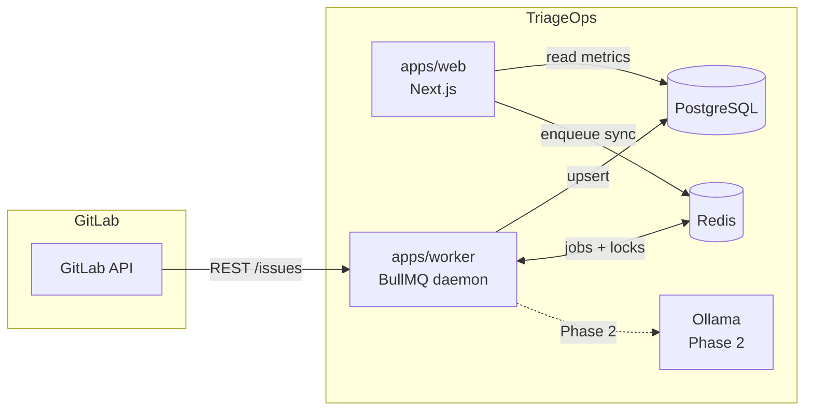

# Architecture

## System overview

TriageOps follows a **sync-and-analyze** pattern: a background worker pulls issue data from GitLab into Postgres; the web app reads that local data to compute and display triage metrics without hammering the GitLab API on every page load.



---

## Monorepo packages

### `apps/web` — Dashboard (Next.js)

**Role:** User-facing UI and API routes.

| Concern | Technology |
|---------|------------|
| Framework | Next.js 16 App Router |
| Styling | Tailwind CSS v4 (Shadcn UI planned) |
| Data access | `@triage-ops/db` (Prisma) |
| Deployment | Standalone Docker image on port 3000 |

**Planned responsibilities:**
- Display triage metrics (ghost, zombie, milestone decay)
- Manage GitLab connections and registered projects
- Trigger sync jobs by enqueueing to BullMQ via Redis

**Current state:** Default Next.js starter page only.

---

### `apps/worker` — Background daemon

**Role:** Long-running Node process that consumes BullMQ jobs.

| Module | Path | Purpose |
|--------|------|---------|
| Entry point | `src/index.ts` | Starts BullMQ worker, handles graceful shutdown |
| GitLab client | `src/lib/gitlab/client.ts` | Paginated fetch of project issues via GitLab REST API |
| Redis locks | `src/lib/lock.ts` | Distributed lock per project (`SET NX` + token-safe release) |
| Sync queue | `src/queues/sync-queue.ts` | Queue factory and connection config |
| Sync processor | `src/workers/sync-worker.ts` | Job handler: fetch → upsert issues → update `SyncRun` |
| Config | `src/config/env.ts` | Required env var validation |

**Job flow (`gitlab-sync` queue):**

1. Job received with payload `{ projectId, syncRunId }`
2. Acquire Redis lock for `sync:{projectId}` (skip if already locked)
3. Mark `SyncRun` as `RUNNING`
4. Load `Project` + `GitLabConnection` from Postgres
5. Paginate GitLab `/api/v4/projects/:id/issues` (100 per page)
6. Upsert each issue into `issues` table
7. Mark `SyncRun` as `COMPLETED` (or `FAILED` on error)
8. Release lock

**Retry policy:** 3 attempts, exponential backoff starting at 5 s.

---

### `packages/db` — Data layer

**Role:** Single Postgres access point for the entire monorepo.

| Asset | Path |
|-------|------|
| Schema | `prisma/schema.prisma` |
| Migrations | `prisma/migrations/` |
| Client | `src/client.ts` (singleton) |
| Public API | `src/index.ts` |

**Design constraints enforced in schema:**

- One GitLab project per connection: `@@unique([connectionId, gitlabProjectId])`
- One issue per project IID: `@@unique([projectId, gitlabIssueIid])`
- Cascade deletes from connection → project → issues
- Indexes on `Issue.state`, `Issue.lastActivityAt` for metric queries

**Scripts:**

```bash
npm run db:generate -w @triage-ops/db   # Regenerate Prisma client
npm run db:migrate -w @triage-ops/db    # Dev migration
npm run db:migrate:deploy -w @triage-ops/db  # Production deploy
```

---

### `packages/shared-types` — Cross-package contracts

**Role:** Types and constants shared between worker and web without circular dependencies.

Exports:
- `QUEUE_NAMES.GITLAB_SYNC`
- `SyncJobPayload`
- `GitLabIssueRaw`, `GitLabIssuesPage`, `FetchGitLabIssuesParams`

---

## Infrastructure services

| Service | Image | Host port | Purpose |
|---------|-------|-----------|---------|
| `postgres` | `postgres:16-alpine` | **5433** | Primary datastore |
| `redis` | `redis:7-alpine` | 6379 | BullMQ job queue + distributed locks |
| `ollama` | `ollama/ollama:latest` | 11434 | Local LLM inference (Phase 2) |
| `web` | Built from `apps/web/Dockerfile` | 3000 | Production web server |
| `worker` | Built from `apps/worker/Dockerfile` | — | Production worker daemon |

> **Note:** Postgres is mapped to host port **5433** (not 5432) to avoid conflicts with a locally installed Postgres instance.

---

## Metric definitions (planned)

These metrics will be computed from synced `Issue` rows in Phase 1 MVP:

| Metric | Definition (draft) |
|--------|-------------------|
| **Ghost ticket** | Open issue with no activity (`lastActivityAt`) beyond N days |
| **Zombie ticket** | Open issue assigned but stale — no updates and no milestone |
| **Milestone decay** | Active milestone past `dueDate` with open issues still attached |

Exact thresholds (N days) will be configurable in MVP settings.

---

## Testing architecture

- **Framework:** Vitest (TypeScript-native, fast)
- **HTTP mocking:** MSW (Mock Service Worker) — no real network calls in unit tests
- **Location:** Tests live next to source (`*.test.ts`) in `apps/worker`
- **TDD rule:** Write test contract before implementing core utilities (GitLab client, handlers)

See [Development Guide](./development-guide.md) for the full TDD checklist.
