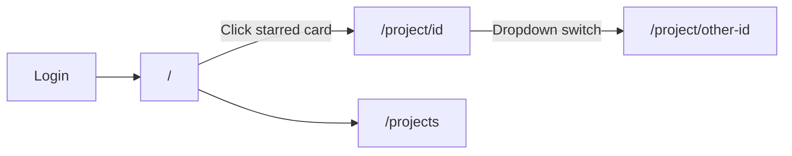
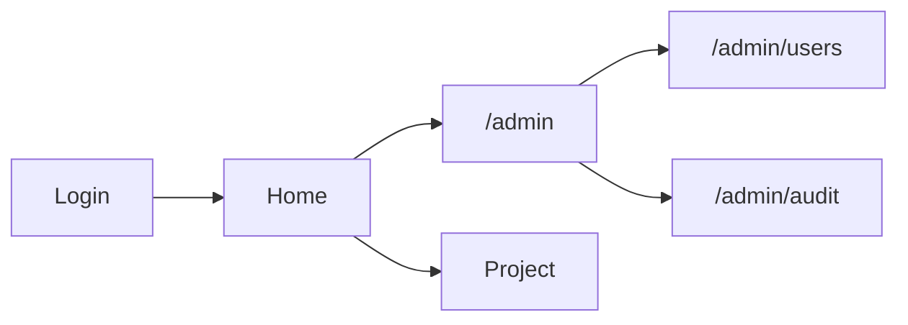

# Dashboard UI restructure

Last updated: June 2026

This document tracks the **role-aware navigation refactor** — moving from a single flat triage dashboard to a home → project workspace → admin console model.

See [Implementation Phases](./phases.md) Step 13 (admin dashboard) for the original roadmap item.

---

## Goals

1. **Home first** — after login, users see a personal summary (starred projects, role), not the full triage view.
2. **Project workspace** — triage metrics and AI suggestions live under `/project/[id]`.
3. **Admin console** — admins get an overview at `/admin` before drilling into Users or Audit.
4. **Role-aware nav** — sidebar shows only what the user's role can use; route guards back this up.

---

## Route map

| Route | Access | Purpose |
|-------|--------|---------|
| `/` | Authenticated | **Home** — welcome, role badge, starred project cards |
| `/project/[id]` | Project access | **Triage workspace** — metrics, thresholds, suggestions |
| `/projects` | Authenticated | **All projects** — register, sync, favorites, settings |
| `/connections` | `connections.manage` (ADMIN) | VCS connection CRUD |
| `/admin` | ADMIN | **Admin overview** — user counts, pending invites, quick links |
| `/admin/users` | ADMIN | User list, invites, role changes |
| `/admin/audit` | ADMIN | Audit event log |
| `/login`, `/setup` | Bootstrap | Unchanged |

### Redirects

| Legacy URL | Target |
|------------|--------|
| `/?project={id}` | `/project/{id}` |

### API routes

No path changes. All project data still flows through `/api/projects/[id]/…`.

---

## User journeys

### Regular user (VIEWER / OPERATOR / LEAD)

- **VIEWER / OPERATOR** — sidebar: Home, Projects (no Connections).
- **LEAD** — same as above; can sync/analyze inside a project but not manage connections.

### Admin

- Workspace sidebar includes **Admin** → `/admin`.
- Inside `/admin/*`, sidebar switches to **admin console** nav (Overview, Users, Audit) with “Back to workspace”.

---

## Implementation status

| Step | Description | Status |
|------|-------------|--------|
| 1 | Move triage to `/project/[id]` | ✅ Done |
| 2 | Redirect `/?project=` → `/project/[id]` | ✅ Done |
| 3 | Home page + `getHomeSummary()` + project cards | ✅ Done |
| 4 | Project selector → `/project/[id]` | ✅ Done |
| 5 | Admin overview `/admin` + admin sub-nav | ✅ Done |
| 6 | Two-shell sidebar + permission-gated Connections | ✅ Done |
| 7 | Breadcrumbs + projects table dashboard link | ✅ Done |
| 8 | Project health strip on home cards | ✅ Done |
| 9 | Role capability chips on home | ✅ Done |
| 10 | Command palette (⌘K) | ✅ Done |

---

## Next batch (June 2026 — prioritized)

### Do now

| Item | Notes | Est. | Status |
|------|-------|------|--------|
| **Health strip on `/projects` table** | Reuse `ProjectHealthStrip` + `fetchProjectsHealthMap()` | ~0.5 day | ✅ Done |
| **Home empty-state fix** | Non-admins: link to `/projects`, not `/connections` | ~1 hour | ✅ Done |
| **User CRUD (admin)** | Edit role, deactivate/revoke access, delete user, cancel pending invite; API + audit | ~2–3 days | ✅ Done |
| **Admin dashboard extras** | Auth status, job overview, connections overview (metadata only) | ~2 days | ✅ Done |

Suggested order: **polish (health strip + empty state) → user CRUD → admin extras** — polish is quick; CRUD and admin board fit one admin-focused PR.

### Later (backlog)

| Item | When |
|------|------|
| Last visited project (“Continue”) | Far later |
| Onboarding checklist | Not needed while UI stays simple and admin is primary setup actor |
| `ProjectMembership` (user ↔ project) | After user CRUD; needed for larger orgs, not SME intranet yet |
| Change log + export (Phase 15) | On list |
| Impact reporting / metric snapshots (Phase 16) | On list |
| Triage sessions / rollback (Phase 17+) | On list |
| Mobile layouts | Skipped (intranet laptop-first) |

---

## Phase / product items (unchanged roadmap)

| Item | Status |
|------|--------|
| Impact reporting / metric snapshots | Phase 16 ([phases.md](./phases.md)) |
| Change log + export | Phase 15 |
| Rollback / triage sessions | Phase 17+ |

---

## Key files

### Pages

| File | Role |
|------|------|
| `apps/web/app/(dashboard)/page.tsx` | Home |
| `apps/web/app/(dashboard)/project/[id]/page.tsx` | Project triage workspace |
| `apps/web/app/(dashboard)/project/project-selector.tsx` | In-workspace project dropdown |
| `apps/web/app/(dashboard)/projects/page.tsx` | All projects index |
| `apps/web/app/(dashboard)/connections/page.tsx` | Connections (ADMIN only) |
| `apps/web/app/(dashboard)/admin/page.tsx` | Admin overview |
| `apps/web/app/(dashboard)/admin/layout.tsx` | ADMIN role guard |
| `apps/web/app/(dashboard)/admin/users/page.tsx` | User management |
| `apps/web/app/(dashboard)/admin/audit/page.tsx` | Audit log |

### Components

| File | Role |
|------|------|
| `apps/web/components/app-sidebar.tsx` | Workspace vs admin shell nav |
| `apps/web/components/app-shell.tsx` | Sidebar wrapper; passes capabilities |
| `apps/web/components/breadcrumbs.tsx` | Page trail |
| `apps/web/components/home/project-card.tsx` | Starred project card on home |
| `apps/web/components/home/role-capability-chips.tsx` | Role permission hints on home |
| `apps/web/components/project/project-health-strip.tsx` | Sync / analysis / suggestion health row |
| `apps/web/components/command-palette.tsx` | ⌘K quick jump dialog + sidebar hint |
| `apps/web/components/command-palette-root.tsx` | Server wrapper loading projects + capabilities |
| `apps/web/components/ui/command.tsx` | cmdk + dialog command primitives |
| `apps/web/components/ui/dialog.tsx` | Modal dialog primitive |

### Services

| Function | File | Purpose |
|----------|------|---------|
| `getHomeSummary(ctx)` | `lib/services/home.ts` | Home page data: user, starred projects with light metrics |
| `pickHomeProjectCards(projects)` | `lib/services/home.ts` | Filter favorites for home grid |
| `formatUserRole(role)` | `lib/services/home.ts` | Display label for role badge |
| `buildProjectHealthSignals(input)` | `lib/services/project-health.ts` | Health strip labels for project cards |
| `fetchProjectHealthSignals(project)` | `lib/services/project-health.ts` | Load health signals for one project |
| `fetchProjectsHealthMap(projects)` | `lib/services/project-health.ts` | Batch health map for projects table |
| `getRoleCapabilityLabels(role)` | `lib/auth/permissions.ts` | Human-readable capability chips for home |
| `projectDashboardPath(id)` | `lib/navigation.ts` | Canonical `/project/[id]` href |
| `legacyProjectRedirectPath(param)` | `lib/navigation.ts` | Maps `/?project=` to project workspace |
| `buildCommandPaletteItems(projects, caps)` | `lib/command-palette.ts` | Navigation + project jump targets for ⌘K |
| `groupCommandPaletteItems(items)` | `lib/command-palette.ts` | Group palette entries for display |
| `getAdminOverview()` | `lib/services/admin.ts` | Full admin dashboard payload |
| `getAdminAuthStatus()` | `lib/services/admin.ts` | OAuth, setup, sessions, allowlist summary |
| `mergeJobFailures(failures, limit)` | `lib/services/admin.ts` | Sort/limit combined job failure rows |
| `listUsers()` | `lib/services/admin.ts` | All users (admin) |
| `cancelPendingInvite(ctx, inviteId)` | `lib/services/admin.ts` | Cancel unclaimed invite |
| `setUserDeactivated(ctx, userId, flag)` | `lib/services/admin.ts` | Block sign-in + revoke sessions |
| `deleteUser(ctx, userId)` | `lib/services/admin.ts` | Remove user account |
| `getProjectMetrics(id)` | `lib/services/metrics.ts` | Full triage payload for project workspace |
| `getProjectById(ctx, id)` | `lib/services/projects.ts` | Access check + project metadata |
| `listProjects(ctx)` | `lib/services/projects.ts` | Projects visible to user (respects `AUTH_DATA_SCOPE`) |

### Auth / permissions

| File | Role |
|------|------|
| `lib/auth/permissions.ts` | `getRoleCapabilities()`, permission matrix |
| `lib/auth/access.ts` | `projectWhereClause`, `connectionWhereClause` |
| `apps/web/proxy.ts` | Auth middleware matcher (includes `/project/*`, `/admin`) |

---

## Permission → UI mapping

| Capability | Role(s) | UI effect |
|------------|---------|-----------|
| `connections.manage` | ADMIN | Connections nav + `/connections` page |
| `projects.manage` | ADMIN | Add project form on `/projects` |
| `project.sync` | ADMIN, LEAD | Sync button on projects table |
| `project.analyze` | ADMIN, LEAD | Run analysis in project workspace |
| `project.settings` | ADMIN, LEAD | Threshold / auto-sync controls |
| `suggestion.apply` | ADMIN, LEAD, OPERATOR | Apply suggestions |
| `suggestion.dismiss` | ADMIN, LEAD | Dismiss suggestions |
| `suggestions.read` | All | View suggestions panel |
| `admin.users` | ADMIN | Admin console |
| `admin.audit` | ADMIN | Audit log |

---

## Out of scope (this refactor)

- Per-project membership (`ProjectMembership`)
- Metric snapshots / campaign reporting (Phase 16)
- Onboarding checklist
- Mobile-specific layouts
- Last-visited project shortcut (“Continue”)
