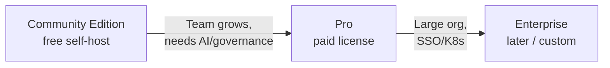

# Editions — Community vs Pro

Last updated: June 2026

This document evaluates an **open-core / freemium-on-prem** model for TriageOps: a **Community Edition (CE)** that is genuinely useful for free self-hosting, and a **Pro** edition with paid features for teams that need automation, AI, governance, and write-back.

**Status:** Product direction · **not implemented in code yet** (no license gating). Use this when planning pricing, packaging, and `AppSettings.license` work.

**Related:** [On-Prem Product Model](./on-prem-product.md) · [Production Readiness](./production-readiness.md) · [Phases § 3c billing](./phases.md#phase-3c--deployment--scale-optional)

---

## Evaluation — is CE + Pro a good fit?

### Yes, for this product

| Reason | Detail |
|--------|--------|
| **Clear value ladder** | Sync + metrics are the hook; AI + write-back + multi-user governance are natural upsells |
| **On-prem norm** | GitLab CE/EE, Grafana OSS/Enterprise, Sentry — teams expect self-host free tier + paid ops features |
| **Cost alignment** | LLM (Ollama GPU/RAM) and write-back (VCS risk) justify Pro; CE stays cheap to run |
| **Adoption** | CE lets a solo dev or small team prove value before procurement |
| **Your roadmap** | Phase 15–17 (change log, reporting, rollback) map cleanly to Pro-only |

### Risks to manage

| Risk | Mitigation |
|------|------------|
| CE too limited → nobody tries it | Keep **full sync + full metrics** in CE; limit scale and automation, not core triage |
| CE too generous → no upgrades | Gate **write-back, LLM, RBAC depth, audit, auto-sync** — what teams pay for at scale |
| License bypass (self-host) | Same as all on-prem: honor system + optional key; **supported path** is Pro image + contract |
| Complexity too early | Ship **one Pro SKU** first; no Enterprise tier until customers ask |

### Recommended model



- **CE:** Free, self-host, source or public image — “see your triage debt.”
- **Pro:** Paid license key — “automate triage with AI and operate as a team.”
- **Enterprise:** Defer — SSO direct, Helm, SLA, air-gapped support (custom quote).

---

## Edition tags

Every feature below is tagged:

| Tag | Meaning |
|-----|---------|
| **`[CE]`** | Included in Community Edition |
| **`[PRO]`** | Pro only (license required) |
| **`[CE-LIMIT]`** | In CE with caps (see limits table) |
| **`[FUTURE-PRO]`** | Not built yet; planned Pro when shipped |
| **`[ENT]`** | Enterprise / custom (post-Pro) |

---

## Feature matrix

### Core triage (the hook — mostly CE)

| Feature | Tag | Rationale |
|---------|-----|-----------|
| GitHub + GitLab connections | `[CE-LIMIT]` | 1 connection in CE; unlimited in Pro |
| Register projects | `[CE-LIMIT]` | Up to **3 projects** in CE |
| Manual sync | `[CE]` | Core loop must work |
| Sync history / sync runs | `[CE]` | Operational visibility |
| Triage metrics (ghost, zombie, milestone decay) | `[CE]` | Main product value |
| Metric thresholds (per project) | `[CE]` | Configuration, not enterprise |
| Dashboard home + project workspace | `[CE]` | Full UI for triage |
| Projects list, favorites | `[CE]` | |
| Command palette navigation | `[CE]` | |
| Issue / milestone tables on dashboard | `[CE]` | |

### LLM & suggestions

| Feature | Tag | Rationale |
|---------|-----|-----------|
| Run LLM analysis (Ollama) | `[PRO]` | Compute cost + flagship automation |
| Duplicate detection suggestions | `[PRO]` | |
| Description draft suggestions | `[PRO]` | |
| Suggestions panel (review UI) | `[PRO]` | CE may show empty state + upgrade hint |
| Clear analysis history | `[PRO]` | |
| `llm-analysis` worker queue | `[PRO]` | Disabled without license |

### VCS write-back

| Feature | Tag | Rationale |
|---------|-----|-----------|
| Apply suggestion → GitHub/GitLab | `[PRO]` | High impact; liability + support |
| `vcs-writeback` worker queue | `[PRO]` | |
| APPLYING / APPLY_FAILED / retry UX | `[PRO]` | |
| Dismiss suggestions (without VCS change) | `[CE-LIMIT]` | CE: dismiss only; Pro: dismiss + apply |

### Sync automation

| Feature | Tag | Rationale |
|---------|-----|-----------|
| Auto-sync scheduler (`autoSyncEnabled`) | `[PRO]` | Hands-off ops |
| Webhook-triggered sync | `[FUTURE-PRO]` | Phase 3b |
| Per-project sync interval settings | `[PRO]` | |

### Auth & users

| Feature | Tag | Rationale |
|---------|-----|-----------|
| OAuth sign-in (GitHub/GitLab) | `[CE]` | Required for any multi-user CE |
| Instance bootstrap (`/setup`) | `[CE]` | |
| Closed registration (invite-only) | `[CE-LIMIT]` | CE: max **5 users**; Pro: unlimited |
| Email/domain allowlist | `[CE]` | Security baseline |
| **`ADMIN` role** | `[CE]` | One admin runs small CE install |
| **`VIEWER` role** | `[CE-LIMIT]` | CE: viewers allowed within user cap |
| **`LEAD` / `OPERATOR` roles** | `[PRO]` | Separated duties = team product |
| Admin console (`/admin`) | `[CE-LIMIT]` | CE: users list only; Pro: full overview |
| Invite / provision users | `[CE-LIMIT]` | Within CE user cap |
| Deactivate / delete users | `[CE-LIMIT]` | CE: basic; Pro: full CRUD + audit tie-in |

### Governance & compliance

| Feature | Tag | Rationale |
|---------|-----|-----------|
| Audit event log | `[PRO]` | Compliance / ops |
| Admin audit UI | `[PRO]` | |
| Auth status dashboard (providers, sessions) | `[PRO]` | |
| Job failure overview (sync/LLM/write-back) | `[PRO]` | |
| Connections overview (metadata, no tokens) | `[PRO]` | |
| Change log + CSV export | `[FUTURE-PRO]` | Phase 15 |
| Impact reporting / metric snapshots | `[FUTURE-PRO]` | Phase 16 |
| Write-back rollback | `[FUTURE-PRO]` | Phase 17 |
| `ProjectMembership` (per-project access) | `[FUTURE-PRO]` | Larger orgs |

### Security & infrastructure

| Feature | Tag | Rationale |
|---------|-----|-----------|
| HTTPS / reverse proxy (ops) | `[CE]` | Required for both |
| Session auth + API 401 enforcement | `[CE]` | |
| PAT encryption at rest (`TOKEN_ENCRYPTION_KEY`) | `[PRO]` | Enterprise security expectation |
| API rate limiting | `[FUTURE-PRO]` | Abuse protection at scale |
| Enterprise SSO (SAML/OIDC direct) | `[ENT]` | Not GitHub/GitLab OAuth upstream |

### Packaging & support

| Feature | Tag | Rationale |
|---------|-----|-----------|
| Self-host Docker Compose | `[CE]` | |
| Public CE image or build from source | `[CE]` | |
| Pro install bundle (private registry) | `[PRO]` | |
| License key activation | `[PRO]` | |
| Email / priority support | `[PRO]` | |
| Helm chart | `[ENT]` | |

---

## CE limits (suggested defaults)

| Limit | CE | Pro |
|-------|-----|-----|
| Registered projects | 3 | Unlimited |
| VCS connections | 1 | Unlimited |
| Users (invited) | 5 | Unlimited |
| Roles available | `ADMIN`, `VIEWER` | All four roles |
| LLM analysis | — | ✅ |
| Apply to VCS | — | ✅ |
| Auto-sync | — | ✅ |
| Audit log | — | ✅ |
| PAT encryption | Optional manual | Recommended + documented |

Limits are **soft gates** in UI + API (`403` + upgrade message), not hard database blocks — keeps CE honest without forked schema.

---

## What stays free — and why

**Do not paywall:**

- Ghost / zombie / milestone decay metrics — that's the “aha” moment
- Manual sync — proves the pipeline
- One connection, a few projects — enough for a side project or POC

**Do paywall:**

- Anything that **mutates VCS** automatically (apply, future rollback)
- Anything that **costs compute** (LLM)
- Anything that **scales teams** (full RBAC, audit, unlimited users)
- Anything that **runs unattended** (auto-sync, webhooks)

---

## Implementation sketch (when you build it)

Not started. Rough plan:

| Layer | Approach |
|-------|----------|
| **Data** | `AppSettings.edition: CE \| PRO`, `licenseKey`, `licenseExpiresAt`, optional signed JWT from your license server |
| **Runtime** | `getEditionFeatures()` → `{ canAnalyze, canApply, maxProjects, … }` |
| **Enforcement** | API routes + worker job enqueue check edition before `analyze`, `apply`, `auto-sync` |
| **UI** | Badges on nav (“Pro”), disabled buttons + upgrade link, admin shows edition |
| **Images** | **Option A (simple):** one image, license unlocks Pro · **Option B:** `triage-ops-web:ce` vs `:pro` build flags |

Place in codebase (future):

```
apps/web/lib/license/edition.ts      # feature flags
apps/web/lib/license/require-pro.ts  # API guard
packages/db — AppSettings fields
```

**When to implement:** After Gate B distribution ([production-readiness.md](./production-readiness.md)) and first pilot feedback — not before core product is stable.

---

## Pricing shape (placeholder — not decided)

| Edition | Price idea | Buyer |
|---------|------------|-------|
| **CE** | Free | Individual, OSS team, evaluation |
| **Pro** | Per-instance / year (e.g. flat €X–Yk) or per-seat above N users | Team lead, engineering manager |
| **Enterprise** | Custom | IT procurement, SSO, SLA |

Avoid per-sync or per-issue metering — too noisy for on-prem.

---

## Open-core repo strategy

| Approach | CE | Pro |
|----------|-----|-----|
| **A — Same private repo, license key** | Easiest; one codebase | Unlock via key |
| **B — Public CE repo + private Pro plugin** | GitHub public mirror of CE features | Pro as private module or overlay |
| **C — Public source, Pro = support + images** | All source public (like GitLab CE code) | Paid registry + license |

**Recommendation for TriageOps v1:** **Option A** until traction; consider **B** if you want GitHub stars and community PRs on CE-only paths.

---

## Summary

| Question | Answer |
|----------|--------|
| Good idea? | **Yes** — matches product shape and on-prem market |
| CE hook? | **Sync + metrics + manual triage** |
| Pro wedge? | **LLM + write-back + RBAC/audit + automation + encryption** |
| Build now? | **No** — document and pilot first; license gating after distribution pipeline |
| Tagging | **`[CE]` / `[PRO]` / `[CE-LIMIT]` / `[FUTURE-PRO]` / `[ENT]`** in matrix above |

When implementing, add edition checks next to existing permission checks in `lib/auth/permissions.ts` — permissions answer *who*; edition answers *what the instance paid for*.
