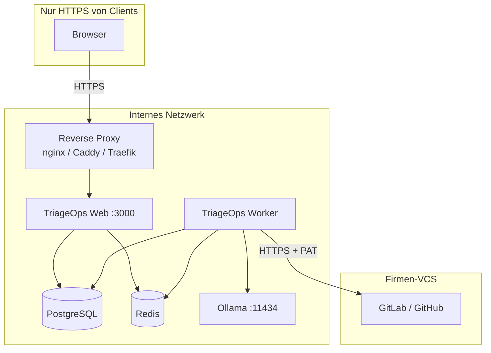

# Intranet-Rollout — Checkliste & Installation

Schritt-für-Schritt-Anleitung für den **Produktivbetrieb im Firmen-Intranet** mit Docker Compose.

**Zielgruppe:** IT/Ops, die TriageOps einmalig aufsetzen und an ein Team ausrollen.

**Verwandte Docs:** [Security](./security.md) (Härtung, Reviewer-FAQ) · [Running the App](./running-the-app.md) (lokale Entwicklung) · [Architecture](./architecture.md)

---

## Deployment-Optionen

| Methode | Status | Wann nutzen |
|---------|--------|-------------|
| **Docker Compose** | ✅ Verfügbar | Intranet, ein Host/VM, Pilot bis mittlerer Betrieb |
| **Helm (Kubernetes)** | 🔜 Geplant (Phase 3c) | K8s-Cluster, GitOps, mehrere Umgebungen — **noch nicht verfügbar** |

> **Hinweis Helm:** Ein offizielles Helm-Chart ist auf der Roadmap ([phases.md](./phases.md#phase-3c--deployment--scale-optional)), aber **noch nicht implementiert**. Bis dahin ist Docker Compose der unterstützte Weg für On-Prem. Wer bereits auf Kubernetes läuft, kann die Compose-Services als Referenz für eigene Manifeste nutzen — ein fertiges Chart folgt später.

---

## Übersicht der Komponenten



| Service | Container | Interner Port | Nach außen exponieren? |
|---------|-----------|---------------|------------------------|
| Web | `triage-ops-web` | 3000 | Nur via Reverse Proxy (HTTPS) |
| Worker | `triage-ops-worker` | — | Nein |
| Postgres | `triage-ops-postgres` | 5432 | **Nein** |
| Redis | `triage-ops-redis` | 6379 | **Nein** |
| Ollama | `triage-ops-ollama` | 11434 | **Nein** (nur Worker-Zugriff) |

---

## Phase 0 — Vor dem Rollout (organisatorisch)

- [ ] **Ziel-URL** festgelegt (z. B. `https://triageops.company.internal`)
- [ ] **GitLab-OAuth-App** (oder GitHub) beim VCS-Admin beantragt
- [ ] **E-Mail-Allowlist** definiert (`ALLOWED_EMAIL_DOMAINS` oder `ALLOWED_EMAILS`)
- [ ] **VCS-PAT-Richtlinie:** wer darf Connections anlegen, welche Scopes, Rotationsintervall
- [ ] **Host/VM** mit Docker + Compose (mind. 4 GB RAM empfohlen, mehr wenn Ollama-Modelle groß)
- [ ] **Backup-Konzept** für Postgres-Volume
- [ ] Bei mehreren Rollen (Admin vs. Operator): [Phase 4 Governance](./phases.md#phase-4--governance-admin--operations-planned) eingeplant — aktuell haben alle eingeloggten Nutzer dieselben Rechte

---

## Phase 1 — Server vorbereiten

### 1.1 Repository & Abhängigkeiten

```bash
git clone <repo-url> triage-ops
cd triage-ops
```

Auf dem Zielserver:

| Tool | Version |
|------|---------|
| Docker + Docker Compose | aktuell stabil |
| Git | beliebig |

Node.js ist **nur für lokale Entwicklung** nötig — der Produktiv-Stack läuft vollständig in Containern.

### 1.2 Umgebungsdatei anlegen

```bash
cp .env.example .env
```

**Nicht** `db:seed` im Produktivbetrieb ausführen — das legt Platzhalter-Connections mit Dummy-Tokens an.

### 1.3 Produktions-`.env` (Beispiel Intranet + GitLab)

Passe Hostnamen, Secrets und Passwörter an:

```env
# ── Datenbank & Queue (Compose-Service-Namen) ─────────────────────────────
DATABASE_URL=postgresql://triage_ops:<STARKES-PASSWORT>@postgres:5432/triage_ops
REDIS_URL=redis://redis:6379

# ── Ollama (Worker spricht Container-Namen an) ──────────────────────────────
OLLAMA_HOST=http://ollama:11434
OLLAMA_CHAT_MODEL=llama3.2:3b
OLLAMA_EMBED_MODEL=nomic-embed-text

# ── Worker ──────────────────────────────────────────────────────────────────
WORKER_CONCURRENCY=2
LLM_WORKER_CONCURRENCY=1
WRITEBACK_WORKER_CONCURRENCY=2
AUTO_SYNC_SCHEDULER_ENABLED=true
AUTO_SYNC_TICK_MINUTES=15

# ── Sicherheit (Pflicht Produktion) ─────────────────────────────────────────
TOKEN_ENCRYPTION_KEY=<openssl rand -base64 32>
AUTH_DISABLED=false
AUTH_SECRET=<openssl rand -base64 32>
AUTH_URL=https://triageops.company.internal
AUTH_PROVIDERS=gitlab
AUTH_DATA_SCOPE=shared
ALLOWED_EMAIL_DOMAINS=company.com

AUTH_GITLAB_ID=<oauth-app-id>
AUTH_GITLAB_SECRET=<oauth-app-secret>
AUTH_GITLAB_ISSUER=https://gitlab.company.internal

# ── Web ─────────────────────────────────────────────────────────────────────
PORT=3000
NODE_ENV=production
```

Secrets generieren:

```bash
openssl rand -base64 32   # für AUTH_SECRET
openssl rand -base64 32   # für TOKEN_ENCRYPTION_KEY
```

### 1.4 Postgres-Passwort in Compose anpassen

Die mitgelieferte `docker-compose.yml` nutzt Dev-Defaults (`triage_ops` / `triage_ops`). Für Produktion **Passwort ändern** und konsistent in `DATABASE_URL` sowie `postgres.environment` setzen:

```yaml
environment:
  POSTGRES_USER: triage_ops
  POSTGRES_PASSWORD: <STARKES-PASSWORT>
  POSTGRES_DB: triage_ops
```

Gleiches Passwort in `web`, `worker` und `migrate` unter `environment.DATABASE_URL` verwenden.

Optional: Postgres- und Redis-**Port-Mappings** (`5433:5432`, `6379:6379`) in Produktion entfernen, damit die Dienste nur im Docker-Netz erreichbar sind.

---

## Phase 2 — OAuth-App registrieren

### GitLab (empfohlen für Intranet)

1. GitLab Admin → **Applications** (oder User Settings → Applications)
2. **Redirect URI:** `https://triageops.company.internal/api/auth/callback/gitlab`
3. Scopes: `read_user` (ggf. `openid`, `profile`, `email` je nach Instanz)
4. Client ID und Secret in `.env` als `AUTH_GITLAB_ID` / `AUTH_GITLAB_SECRET`
5. `AUTH_GITLAB_ISSUER` auf eure GitLab-Basis-URL setzen

> Login-OAuth ist **getrennt** von Sync-PATs. Nutzer melden sich per GitLab an (Corporate-SSO läuft upstream in GitLab), fügen danach auf der **Connections**-Seite einen PAT für Issue-Sync hinzu.

### GitHub (falls genutzt)

- Callback: `https://triageops.company.internal/api/auth/callback/github`
- Env: `AUTH_GITHUB_ID`, `AUTH_GITHUB_SECRET`

---

## Phase 3 — Stack starten

### 3.1 Images bauen und Dienste starten

```bash
npm run docker:up:all
```

Startet: `postgres`, `redis`, `ollama`, `web`, `worker` (Profile `production`).

### 3.2 Migrationen anwenden

```bash
npm run docker:migrate
```

Erwartung: `migrate deploy` ohne Fehler.

### 3.3 Ollama-Modelle laden (für KI-Triage)

```bash
docker exec triage-ops-ollama ollama pull llama3.2:3b
docker exec triage-ops-ollama ollama pull nomic-embed-text
```

Ohne Modelle funktioniert Sync und Metriken; **Run analysis** schlägt fehl.

### 3.4 Optional: Stack-Verifikation

Auf einem Build-Host mit Node.js:

```bash
npm run docker:verify
```

Prüft Build, Start, Migration und HTTP-Health — sinnvoll vor dem ersten Rollout.

---

## Phase 4 — HTTPS & Reverse Proxy

TriageOps terminiert TLS **nicht selbst**. Ein Reverse Proxy vor `web:3000` ist Pflicht.

**Mindestanforderungen:**

- [ ] HTTPS mit gültigem Zertifikat (interne CA oder Let's Encrypt)
- [ ] `AUTH_URL` = öffentliche HTTPS-URL
- [ ] OAuth-Callbacks nur mit `https://`
- [ ] Firewall: Port 443 nur von erlaubten Client-Netzen

**Beispiel (Caddy — automatisches TLS mit interner CA):**

```caddyfile
triageops.company.internal {
    reverse_proxy localhost:3000
}
```

**Beispiel (nginx):**

```nginx
server {
    listen 443 ssl;
    server_name triageops.company.internal;

    ssl_certificate     /etc/ssl/certs/triageops.crt;
    ssl_certificate_key /etc/ssl/private/triageops.key;

    location / {
        proxy_pass http://127.0.0.1:3000;
        proxy_http_version 1.1;
        proxy_set_header Host $host;
        proxy_set_header X-Forwarded-Proto $scheme;
        proxy_set_header X-Forwarded-For $proxy_add_x_forwarded_for;
    }
}
```

---

## Phase 5 — Abnahme-Checkliste

Nach dem Start alle Punkte durchgehen:

### Sicherheit

- [ ] `AUTH_DISABLED=false` — Login erforderlich
- [ ] `curl -i https://triageops.company.internal/api/projects` ohne Cookie → **401**
- [ ] Anmeldung mit erlaubter E-Mail funktioniert
- [ ] Anmeldung mit nicht erlaubter E-Mail wird abgelehnt
- [ ] `GET /api/connections` enthält **kein** Feld `accessToken`
- [ ] `TOKEN_ENCRYPTION_KEY` gesetzt; neue Connection speichert verschlüsseltes Token (`enc:v1:…` in DB)
- [ ] Postgres und Redis von außen nicht erreichbar

### Funktion

- [ ] **Connections** → GitLab/GitHub-Verbindung mit PAT (`api` GitLab / `repo` GitHub für Write-back)
- [ ] **Projects** → Repo registrieren, **Sync** → Status `COMPLETED`
- [ ] **Dashboard** → Ghost/Zombie/Milestone-Metriken sichtbar
- [ ] Optional **Run analysis** → Vorschläge erscheinen
- [ ] Optional **Apply** auf Vorschlag → Write-back `APPLIED` (prüft PAT-Write-Scopes)
- [ ] Optional **Auto-sync** pro Projekt aktiviert (wenn `AUTO_SYNC_SCHEDULER_ENABLED=true`)

### Betrieb

- [ ] Container-Neustart überlebt Daten (`docker compose restart`)
- [ ] Backup-Job für Volume `postgres_data` getestet
- [ ] Logs erreichbar (`docker compose logs -f web worker`)

---

## Phase 6 — Erste Nutzung (Team-Onboarding)

Kurzablauf für Endnutzer:

1. `https://triageops.company.internal` öffnen → mit GitLab/GitHub anmelden
2. **Connections** → PAT mit passenden Scopes hinterlegen ([Scopes](./running-the-app.md#personal-access-token-scopes))
3. **Projects** → Repository wählen → **Sync**
4. **Dashboard** → Metriken prüfen, Schwellenwerte anpassen
5. Optional: **Run analysis** → Vorschläge prüfen → **Dismiss** oder **Apply**

**Hinweis Write-back:** Apply ändert Issues direkt im VCS (Beschreibung, Duplikat-Kommentar + Close). Nur Nutzer mit entsprechender VCS-Berechtigung und PAT-Scope sollten Apply nutzen.

---

## Betrieb & Wartung

| Aufgabe | Befehl / Hinweis |
|---------|------------------|
| Logs | `docker compose logs -f web worker` |
| Neustart | `docker compose --profile production restart web worker` |
| Update (neue Version) | `git pull` → `npm run docker:up:all` (rebuild) → `npm run docker:migrate` |
| Migrationen (Prod) | `npm run docker:migrate` |
| Stoppen | `npm run docker:down` |
| PAT rotieren | Connection in UI bearbeiten, neuen Token speichern |
| Ollama-Modelle | `docker exec triage-ops-ollama ollama list` |

**Updates:** Nach Schema-Änderungen immer `docker:migrate` ausführen, bevor neue Web/Worker-Versionen Traffic bekommen.

---

## Was (noch) nicht enthalten ist

| Feature | Status | Auswirkung |
|---------|--------|------------|
| **Helm-Chart** | Geplant Phase 3c | K8s-Deploys manuell oder Compose bis Chart verfügbar |
| **RBAC** (Admin/Operator/Viewer) | Phase 4 | Alle eingeloggten Nutzer gleiche Rechte |
| **Audit-Log-UI** | Phase 4 | Kein UI-Export wer was wann geändert hat |
| **Write-back Rollback** | Phase 4 | Fehlerhaftes Apply manuell im VCS korrigieren |
| **Webhooks** (Echtzeit-Sync) | Phase 3b | Polling/Auto-sync statt Push-Events |
| **API Rate Limiting** | Phase 3a | Schutz nur über Netzwerk/Firewall |
| **Direktes SAML/OIDC** zum Firmen-IdP | Phase 3 | SSO indirekt über GitLab/GitHub OAuth |

---

## Schnellreferenz — alle Installationsbefehle

```bash
# 1. Klonen & konfigurieren
git clone <repo-url> triage-ops && cd triage-ops
cp .env.example .env
# → .env und docker-compose.yml Postgres-Passwort anpassen

# 2. Stack starten
npm run docker:up:all
npm run docker:migrate

# 3. LLM-Modelle (optional)
docker exec triage-ops-ollama ollama pull llama3.2:3b
docker exec triage-ops-ollama ollama pull nomic-embed-text

# 4. Reverse Proxy auf :3000 konfigurieren, AUTH_URL setzen, OAuth-App registrieren

# 5. Abnahme: Login → Connection → Project → Sync → Dashboard
```

---

## Sign-off (intern)

| Feld | Wert |
|------|------|
| Ziel-URL | |
| Deployment-Methode | Docker Compose |
| GitLab/GitHub Issuer | |
| Allowlist | |
| TOKEN_ENCRYPTION_KEY gesetzt | ☐ |
| HTTPS aktiv | ☐ |
| Backup getestet | ☐ |
| Abnahme durch | |
| Datum | |
