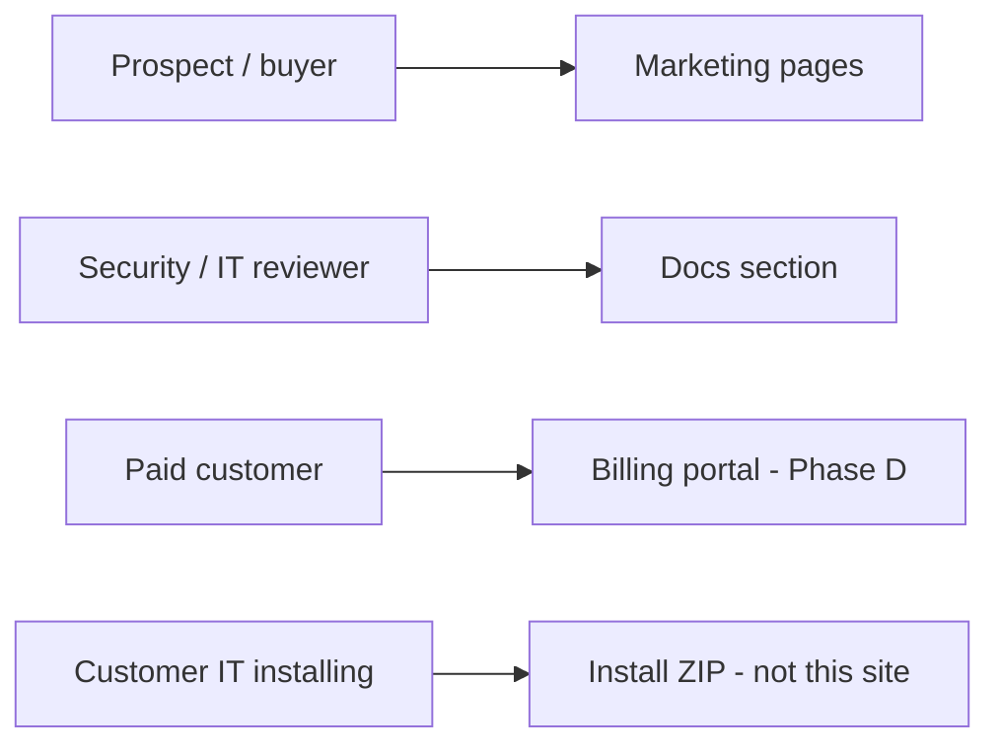
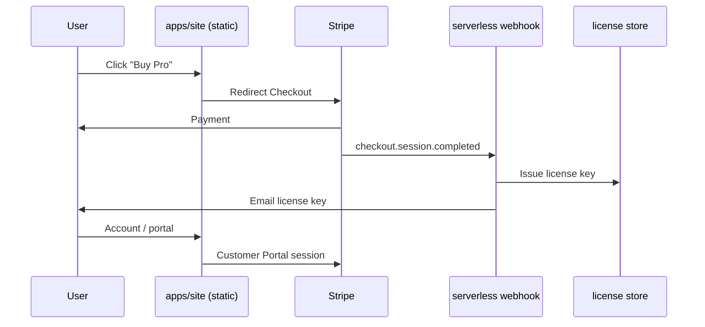

# Landing Page & Product Site — Build Plan

**Purpose:** Blueprint for an agent (or human) implementing Gridnull’ public **marketing + documentation + billing** site as a React SPA in the monorepo.

**Status:** Planning only — **do not implement until** [Phase 5 prerequisites](./phases.md#phase-5--product-presence-optional-post-validation) are met (on-prem workflow validated).

**Related:** [phases.md § Step 18](./phases.md#step-18--landing-page--marketing-site) · [landing-page-content.md](./landing-page-content.md) · [landing-page-agent-prompt.md](./landing-page-agent-prompt.md) · [editions.md](./editions.md) · [security.md](./security.md) · [install/install.md](../install/install.md)

---

## 1. What this site is (and is not)

| In scope | Out of scope |
|----------|--------------|
| Marketing pages (value prop, features, pricing preview) | The Gridnull dashboard (`apps/web`) |
| Public documentation (install, security, architecture) | Customer GHCR registry credentials on the open web |
| Contact / pilot CTA | Self-service product signup that provisions an instance |
| Later: billing portal, license purchase, customer login | Replacing the install ZIP for deployments |

**Three audiences:**



---

## 2. Design direction — simple futuristic, Blade Runner hint

**Tone:** Professional ops tool first, cinematic second. Cyberpunk is an **accent**, not a theme park.

### 2.1 Visual language

| Element | Direction |
|---------|-----------|
| **Mood** | Rainy-night city: deep shadows, selective neon, calm confidence |
| **Base** | Near-black blue-grey backgrounds (`#070b10`, `#0d1219`, `#141c26`) |
| **Primary accent** | Cool cyan / teal neon (`#2ee6d6`, `#5ce1ff`) — UI highlights, links, focus rings |
| **Secondary accent** | Warm amber (`#e8a54b`, `#ff9f43`) — sparingly: badges, “Pro” tier, warnings |
| **Text** | Off-white body (`#e8edf4`), muted secondary (`#8b9cb3`) |
| **Surfaces** | Frosted glass cards: `bg-white/5`, `border-white/10`, subtle inner glow on hover |
| **Lines** | Thin 1px grid or horizon lines at very low opacity (5–8%) |
| **Typography** | Body: `Inter` or `Geist Sans`. Display/headings: `Rajdhani`, `Exo 2`, or `Orbitron` (headlines only — not body) |
| **Imagery** | Real product screenshots on dark UI frames; optional subtle scanline overlay at 3% opacity max |
| **Icons** | Lucide React — thin stroke, consistent with dashboard |

### 2.2 Motion (Framer Motion)

| Pattern | Use |
|---------|-----|
| `fadeInUp` on scroll (stagger children) | Feature grids, doc sections |
| Slow parallax on hero background grid | Home only |
| Subtle `box-shadow` pulse on primary CTA | Hero button (2–3s loop, low amplitude) |
| `layoutId` shared transitions | Docs sidebar ↔ article (optional Phase B) |
| Page transitions | Short opacity + y (200ms) — avoid flashy route wipes |

**Avoid:** glitch effects, heavy RGB split, constant animation, illegible neon-on-neon.

### 2.3 Reference keywords (for agents)

`neo-noir` · `operations console` · `private network` · `local inference` · `triage debt` · `no cloud AI` · `invite-only`

### 2.4 Tailwind token sketch

```css
/* src/styles/tokens.css — implement in Phase A */
:root {
  --color-bg-deep: #070b10;
  --color-bg-elevated: #141c26;
  --color-neon-cyan: #2ee6d6;
  --color-neon-amber: #e8a54b;
  --color-text: #e8edf4;
  --color-text-muted: #8b9cb3;
  --glow-cyan: 0 0 24px rgba(46, 230, 214, 0.25);
}
```

---

## 3. Tech stack

| Layer | Choice | Why |
|-------|--------|-----|
| Framework | **React 19** + **Vite 6** | Fast dev, static deploy, separate from Next.js dashboard |
| Routing | **React Router 7** | Marketing + docs + billing routes in one SPA |
| Styling | **Tailwind CSS 4** | Matches velocity; design tokens via CSS variables |
| Motion | **Framer Motion 11** | Hero, scroll reveals, page transitions |
| Icons | **lucide-react** | Consistent with `apps/web` |
| Docs content | **MDX** or **markdown + gray-matter** (Phase B) | Reuse / adapt monorepo `docs/` and `install/` |
| Syntax highlight | **shiki** or **prism-react-renderer** | Code blocks in docs |
| Forms (Phase A) | Native + serverless endpoint or Formspree | Contact / pilot — **ask owner** |
| Billing (Phase D) | **Stripe Checkout + Customer Portal** (default plan) | Industry standard; swap if owner says otherwise |
| Deploy | Static host (**Cloudflare Pages**, **Netlify**, or **Vercel**) | No server required until billing webhooks |
| Package name | `@gridnull/site` in `apps/site` | Monorepo workspace |

**Explicitly not in stack (unless owner requests):** Next.js for marketing site, heavy CMS (Sanity/Contentful), GraphQL.

---

## 4. Monorepo placement

Add a new workspace app — **do not** fold into `apps/web` (dashboard stays private product UI).

```
gridnull/
├── apps/
│   ├── web/              # existing — Gridnull product dashboard
│   ├── worker/           # existing
│   └── site/             # NEW — public marketing + docs + billing SPA
├── packages/
│   └── site-content/     # OPTIONAL Phase B — shared markdown, edition copy
├── docs/
│   └── landing-page-plan.md   # this file
└── install/              # stays in release ZIP — site links to rendered copies
```

**Root `package.json` scripts to add later:**

```json
"dev:site": "npm run dev -w @gridnull/site",
"build:site": "npm run build -w @gridnull/site"
```

---

## 5. Full folder structure (`apps/site`)

Copy this tree when scaffolding. Files marked `(Phase X)` are added in that phase only.

```
apps/site/
├── package.json
├── vite.config.ts
├── tsconfig.json
├── tsconfig.node.json
├── tailwind.config.ts
├── postcss.config.js
├── index.html
├── .env.example                    # VITE_* public keys only (Stripe publishable, etc.)
├── public/
│   ├── favicon.svg
│   ├── robots.txt
│   ├── og-default.png              # 1200×630 — ask owner for brand asset
│   └── fonts/                      # if self-hosting display font
├── src/
│   ├── main.tsx
│   ├── App.tsx
│   ├── vite-env.d.ts
│   │
│   ├── router/
│   │   ├── index.tsx               # createBrowserRouter
│   │   └── routes.ts               # route constants + metadata (title, description)
│   │
│   ├── layouts/
│   │   ├── RootLayout.tsx          # providers, scroll restoration, ambient grid bg
│   │   ├── MarketingLayout.tsx     # top nav + footer
│   │   ├── DocsLayout.tsx          # sidebar TOC + search (Phase B)
│   │   └── AccountLayout.tsx       # billing header (Phase D)
│   │
│   ├── pages/
│   │   ├── marketing/
│   │   │   ├── HomePage.tsx                    (Phase A)
│   │   │   ├── FeaturesPage.tsx                (Phase A)
│   │   │   ├── SecurityPage.tsx                (Phase A)
│   │   │   ├── EditionsPage.tsx                (Phase A — pricing preview)
│   │   │   ├── ContactPage.tsx                 (Phase A)
│   │   │   ├── ComparePage.tsx                 (Phase C — optional)
│   │   │   └── ChangelogPage.tsx               (Phase C — from GitHub Releases API?)
│   │   ├── docs/
│   │   │   ├── DocsHomePage.tsx                (Phase B)
│   │   │   ├── DocArticlePage.tsx              (Phase B)
│   │   │   ├── InstallGuidePage.tsx            (Phase B — from install/install.md)
│   │   │   └── DocsSearchPage.tsx              (Phase C — optional)
│   │   └── account/
│   │       ├── LoginPage.tsx                   (Phase D)
│   │       ├── PortalPage.tsx                  (Phase D — Stripe customer portal redirect)
│   │       ├── CheckoutSuccessPage.tsx         (Phase D)
│   │       └── LicensePage.tsx                 (Phase D)
│   │
│   ├── components/
│   │   ├── ui/                     # primitives — mirror shadcn-ish API, site-specific skin
│   │   │   ├── Button.tsx
│   │   │   ├── Card.tsx
│   │   │   ├── Badge.tsx
│   │   │   ├── Container.tsx
│   │   │   ├── Section.tsx
│   │   │   └── CodeBlock.tsx
│   │   ├── marketing/
│   │   │   ├── SiteHeader.tsx
│   │   │   ├── SiteFooter.tsx
│   │   │   ├── Hero.tsx
│   │   │   ├── FeatureGrid.tsx
│   │   │   ├── TrustStrip.tsx      # "No cloud AI · On-prem · OAuth"
│   │   │   ├── ArchitectureDiagram.tsx
│   │   │   ├── ScreenshotFrame.tsx
│   │   │   ├── EditionComparisonTable.tsx
│   │   │   ├── PricingCards.tsx
│   │   │   └── ContactForm.tsx
│   │   ├── docs/
│   │   │   ├── DocsSidebar.tsx
│   │   │   ├── DocsToc.tsx
│   │   │   ├── DocsBreadcrumb.tsx
│   │   │   ├── MarkdownRenderer.tsx
│   │   │   └── Callout.tsx         # note / warning / security
│   │   ├── motion/
│   │   │   ├── FadeIn.tsx
│   │   │   ├── StaggerChildren.tsx
│   │   │   ├── ParallaxGrid.tsx
│   │   │   └── PageTransition.tsx
│   │   └── billing/                (Phase D)
│   │       ├── CheckoutButton.tsx
│   │       └── LicenseStatusCard.tsx
│   │
│   ├── content/                    # source markdown / structured copy
│   │   ├── marketing/
│   │   │   ├── home.ts             # typed sections — easier i18n later
│   │   │   ├── features.ts
│   │   │   └── editions.ts         # from docs/editions.md matrix
│   │   └── docs/
│   │       ├── manifest.ts         # sidebar order + slugs
│   │       └── articles/           # synced or copied from docs/
│   │           ├── getting-started.md
│   │           ├── install.md      # render of install/install.md
│   │           ├── security.md
│   │           ├── architecture.md
│   │           └── on-prem-product.md
│   │
│   ├── styles/
│   │   ├── globals.css
│   │   ├── tokens.css
│   │   └── prose.css               # docs typography
│   │
│   ├── lib/
│   │   ├── cn.ts                   # clsx + tailwind-merge
│   │   ├── seo.ts                  # Helmet or react-helmet-async helpers
│   │   ├── analytics.ts            (Phase C — if owner approves)
│   │   └── stripe.ts               (Phase D)
│   │
│   └── hooks/
│       ├── useScrollY.ts
│       └── usePrefersReducedMotion.ts
│
└── scripts/
    ├── sync-docs.ts                # Phase B — copy/transform docs/*.md → src/content/docs
    └── generate-install-html.ts    # Phase B — optional single-file install guide
```

### Optional package: `packages/site-content/`

If docs grow large, extract markdown + edition data:

```
packages/site-content/
├── package.json
├── src/
│   ├── editions.ts       # CE/Pro matrix from editions.md
│   ├── doc-manifest.ts
│   └── articles/           # markdown files
└── scripts/
    └── validate-links.ts
```

---

## 6. Route map

| Path | Page | Phase | Notes |
|------|------|-------|-------|
| `/` | Home | A | Hero, trust strip, 3 feature pillars, CTA |
| `/features` | Features | A | Sync, metrics, LLM, write-back, governance |
| `/security` | Security | A | Reviewer FAQ summary → link to full doc |
| `/editions` | Editions & pricing | A | CE vs Pro from [editions.md](./editions.md); prices TBD |
| `/contact` | Contact / pilot | A | Form or mailto — **ask owner** |
| `/docs` | Docs home | B | Card grid by topic |
| `/docs/install` | Install guide | B | Rendered `install/install.md` |
| `/docs/:slug` | Article | B | security, architecture, rollout, etc. |
| `/compare` | Comparison | C | Optional — vs manual triage / cloud tools |
| `/changelog` | Release notes | C | Optional — GitHub Releases |
| `/account/login` | Customer login | D | Magic link or Stripe identity — **ask owner** |
| `/account/portal` | Billing portal | D | Redirect to Stripe Customer Portal |
| `/checkout/success` | Post-purchase | D | License key delivery UX |

**404:** Custom `NotFoundPage` with link back to docs + contact.

---

## 7. Implementation phases

### Phase A — Marketing shell (MVP public site)

**Goal:** Credible single-product site; enough for security pre-read and pilot conversations.

**Duration estimate:** 3–5 days

**Deliverables:**

- [ ] Vite + React + Tailwind + React Router + Framer Motion scaffold in `apps/site`
- [ ] Design tokens + `MarketingLayout` (header, footer, responsive nav)
- [ ] Pages: Home, Features, Security (summary), Editions, Contact
- [ ] Components: Hero, FeatureGrid, TrustStrip, ScreenshotFrame (placeholder until real screenshots)
- [ ] SEO: per-route `title` / `description` / Open Graph
- [ ] Mobile nav + `prefers-reduced-motion` respected
- [ ] Deploy preview (staging URL)

**Content sources:**

| Page | Pull from |
|------|-----------|
| Features | [current-state.md](./current-state.md), [architecture.md](./architecture.md) |
| Security | [security.md](./security.md) — FAQ section |
| Editions | [editions.md](./editions.md) — matrix + limits table |

**Acceptance criteria:**

- Lighthouse performance ≥ 85 on staging
- No broken internal links
- Contact CTA works (form or mailto per owner decision)
- Site readable without JavaScript for core text (SSR not required; static HTML from Vite build is enough)

---

### Phase B — Documentation section

**Goal:** Public docs without sending users to raw GitHub markdown.

**Duration estimate:** 4–6 days

**Deliverables:**

- [ ] `DocsLayout` with sidebar + in-page TOC
- [ ] `MarkdownRenderer` + `CodeBlock` with copy button
- [ ] `scripts/sync-docs.ts` — copies selected files from `docs/` and `install/` into `src/content/docs/articles/`
- [ ] Pages: Docs home, Install guide, Security (full), Architecture, On-prem bootstrap
- [ ] Internal anchor links work; external GitHub links open in new tab
- [ ] Optional: generate standalone `install.html` into `public/` for download

**Docs to include (minimum):**

| Slug | Source file | Audience |
|------|-------------|----------|
| `install` | `install/install.md` | Customer IT |
| `security` | `docs/security.md` | Reviewers |
| `architecture` | `docs/architecture.md` | Technical buyers |
| `on-prem` | `docs/on-prem-product.md` | Admins |
| `running-the-app` | `docs/running-the-app.md` (OAuth section) | Admins |
| `intranet-rollout` | `docs/intranet-rollout.md` | Ops (consider EN translation) |

**Acceptance criteria:**

- Install guide matches bundle `install.md` after sync script runs
- Code blocks in docker commands are copyable
- Sidebar order defined in `content/docs/manifest.ts`

---

### Phase C — Polish, content, growth

**Goal:** Production-quality marketing; optional discovery features.

**Duration estimate:** 3–5 days

**Deliverables:**

- [ ] Real screenshots / short screen recording in hero (from validated on-prem test)
- [ ] Architecture diagram component (mermaid → static SVG or hand-built React SVG)
- [ ] Compare page (if positioning approved)
- [ ] Changelog from GitHub Releases API (optional)
- [ ] Docs search (Pagefind, Fuse.js, or Algolia — **ask owner**)
- [ ] Analytics (Plausible / Fathom / none — **ask owner**)
- [ ] `sitemap.xml` + `robots.txt`
- [ ] i18n scaffold (if owner wants DE + EN)

**Acceptance criteria:**

- All images have alt text
- Security page answers top 5 reviewer questions without leaving site

---

### Phase D — Billing & customer account

**Goal:** Self-serve or assisted Pro license purchase; customer portal.

**Duration estimate:** 1–2 weeks (depends on license backend)

**Prerequisites:**

- [ ] Edition gating designed in app ([editions.md](./editions.md))
- [ ] Legal: terms, privacy policy URLs (**ask owner**)
- [ ] Stripe (or alternative) account

**Deliverables:**

- [ ] `EditionsPage` → Stripe Checkout for Pro (annual per-instance default)
- [ ] Webhook API (small serverless function **outside** static site, e.g. Cloudflare Worker / Vercel serverless) for `checkout.session.completed`
- [ ] License key generation + email delivery (or manual fulfillment v1 — **ask owner**)
- [ ] `/account/portal` → Stripe Customer Portal (manage subscription, invoices)
- [ ] `LicensePage` — show key, renewal date (authenticated)
- [ ] CE download path: link to public GitHub Release or “contact for pilot” — **ask owner**

**Architecture (billing):**



**Acceptance criteria:**

- Test mode purchase issues test license
- No secret keys in `VITE_*` env vars
- CE path remains free and clearly labeled

---

## 8. Content inventory (reuse map)

| Site section | Monorepo source | Transform |
|--------------|-----------------|-----------|
| Hero copy | New — agent drafts, owner approves | — |
| Feature list | [architecture.md](./architecture.md), [current-state.md](./current-state.md) | Shorten for marketing |
| Security FAQ | [security.md](./security.md) § FAQ | Summary + link to full doc |
| CE / Pro table | [editions.md](./editions.md) | `EditionComparisonTable` props |
| Install steps | [install/install.md](../install/install.md) | Markdown sync |
| Bootstrap flow | [on-prem-product.md](./on-prem-product.md) | Mermaid → SVG |
| Acceptance tests | [e2e-acceptance-test.md](./e2e-acceptance-test.md) | Internal only — not public unless owner wants |

---

## 9. Agent questionnaire — ask the owner before building

**The implementing agent MUST get answers (or explicit defaults) before Phase A code.** Use `AskQuestion` or a short interview message.

### 9.1 Brand & domain

1. **Production domain?** (e.g. `triageops.io`, `triageops.example.com`, subdomain of existing company site)
2. **Staging domain?** (preview deploys)
3. **Product name casing?** Gridnull / Triage Ops / other
4. **Logo assets available?** SVG preferred; if none, use wordmark placeholder until provided
5. **Favicon / OG image?** Provide files or approve generated placeholder

### 9.2 Positioning & audience

6. **Primary buyer persona?** (engineering manager, platform team, security reviewer, solo dev)
7. **Primary VCS story?** GitLab-first, GitHub-first, or equal
8. **Tagline direction?** e.g. “Triage debt, inside your network” — owner to approve final copy
9. **Tone slider:** corporate sober ←→ cyberpunk playful (default: **70% sober / 30% neon**)
10. **Competitor / comparison page?** Yes/no; if yes, which tools to compare against

### 9.3 CTAs & conversion

11. **Primary CTA on home?** (`Contact for pilot` / `Download CE` / `View docs` / `Book a call`)
12. **Contact method?** Form (needs backend), `mailto:`, Cal.com link, or GitHub Discussions
13. **Is CE publicly downloadable?** Free image on GHCR vs contact-only pilot
14. **Pilot process?** Manual approval vs self-serve trial instance (likely manual for v1)

### 9.4 Documentation

15. **Docs language?** English only, German only, or both (intranet-rollout is DE today)
16. **Which docs are public?** Full monorepo docs vs curated subset (see §7 Phase B table)
17. **Keep docs in sync automatically?** CI `sync-docs` on release vs manual copy
18. **Install guide:** render on site only, or also offer downloadable `install.html` / PDF

### 9.5 Legal & trust

19. **Privacy policy URL?** (required before contact form or analytics)
20. **Terms of service URL?** (required before Phase D billing)
21. **Imprint / company legal entity?** (EU: Impressum — owner provides text)
22. **Open-source license mention?** CE license type for public site footer

### 9.6 Technical & hosting

23. **Hosting provider?** Cloudflare Pages / Netlify / Vercel / self-hosted / other
24. **Analytics?** None / Plausible / Fathom / Google Analytics (discouraged for privacy story)
25. **Cookie banner needed?** Depends on analytics + EU traffic
26. **Separate repo or monorepo `apps/site`?** Default: **monorepo**

### 9.7 Billing (Phase D — can defer)

27. **Billing provider?** Stripe (default) / Paddle / manual invoice only
28. **Pro pricing model?** Flat per-instance/year vs per-seat (see [editions.md](./editions.md))
29. **Display prices publicly?** Or “Contact sales” for Pro
30. **License delivery?** Automated key email vs manual after payment
31. **Customer login for portal?** Email magic link / Stripe Customer Portal only / none (email support only)

### 9.8 Assets & validation

32. **Screenshots ready?** If no, use structured placeholder until on-prem test complete
33. **Demo video?** Yes/no; if yes, hosted where (YouTube unlisted, self-hosted)
34. **Block launch until?** Owner sign-off on copy, legal pages, one real screenshot minimum

---

## 10. Default decisions (if owner says “use your judgment”)

| Topic | Default |
|-------|---------|
| Monorepo path | `apps/site` |
| Domain | `triageops.dev` placeholder until provided |
| CTA | “Request pilot” → contact form → Formspree or `mailto:support@…` |
| Docs | English public subset (install, security, architecture, on-prem) |
| Cyberpunk intensity | Subtle — dark + cyan accents, no glitch |
| CE download | Link to GitHub Releases install ZIP; Pro = contact |
| Analytics | None in Phase A–C |
| Billing | Defer Phase D until edition gating exists in product |

---

## 11. CI / release integration (later)

```yaml
# .github/workflows/site.yml (sketch — implement in Phase C)
# on: push to main (docs/** or apps/site/**)
# jobs:
#   - npm run build -w @gridnull/site
#   - deploy to staging
# on: release published
#   - npm run sync-docs (if scripted)
#   - build + deploy production
```

Do **not** add site deploy to `release.yml` until owner confirms hosting.

---

## 12. Definition of done (per phase)

| Phase | Done when |
|-------|-----------|
| **A** | Staging URL live; 5 marketing routes; mobile OK; owner approved copy v1 |
| **B** | Install + security docs render correctly; sync script documented |
| **C** | Real screenshots; sitemap; reviewer can pre-read security without GitHub |
| **D** | Test purchase works; license email received; portal manages subscription |

---

## 13. Handoff checklist for the implementing agent

Before marking work complete, verify:

- [ ] Read [phases.md § Phase 5](./phases.md#phase-5--product-presence-optional-post-validation) — prerequisites met
- [ ] Completed §9 questionnaire with owner (or documented defaults from §10)
- [ ] `npm run build -w @gridnull/site` passes
- [ ] No secrets in client bundle (`grep -r sk_live`, `VITE_.*SECRET` CI check)
- [ ] Marketing claims match shipped product (no fake features)
- [ ] Editions page matches [editions.md](./editions.md) or owner-approved diff
- [ ] Link to install bundle / releases — not raw private registry
- [ ] `prefers-reduced-motion` disables parallax and pulse loops
- [ ] Updated [phases.md § Step 18](./phases.md#step-18--landing-page--marketing-site) checkboxes

---

## 14. Quick start command block (for agent — Phase A day 1)

```bash
# After owner questionnaire — scaffold (agent runs when implementing)
cd apps/site
npm create vite@latest . -- --template react-ts
npm install react-router-dom framer-motion lucide-react clsx tailwind-merge
npm install -D tailwindcss @tailwindcss/vite
# … wire workspaces, tokens, layouts per §5
npm run dev
```

---

## 15. Open questions log

| Date | Question | Owner answer | Decision |
|------|----------|--------------|----------|
| | | | |

_Agent: append rows during implementation._
