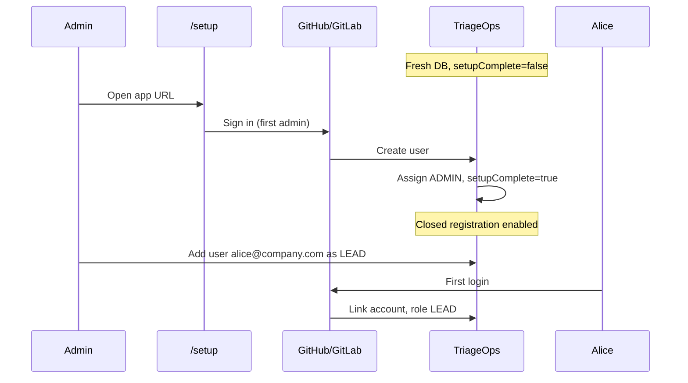
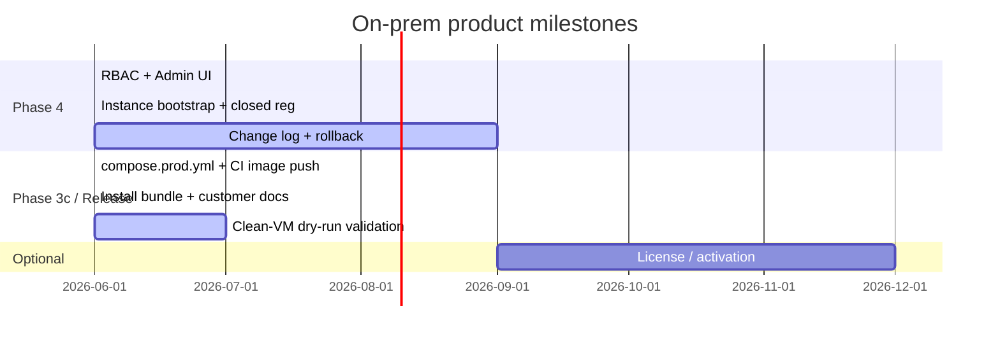

# On-Prem Product Model — Bootstrap, Auth & Distribution

This document records **decisions** for production on-prem deployments: how the first admin is created, how access stays closed, and how customers install TriageOps **without cloning the source repository**.

**Status:** Decided direction · **bootstrap shipped** · **distribution pipeline shipped** (June 2026)

**Related:** [Security](./security.md) · [Intranet Rollout](./intranet-rollout.md) · [Running the App](./running-the-app.md)

---

## Why this document exists

Today, a fresh install can be reached in two weak ways:

| Issue | Risk |
|-------|------|
| `AUTH_DISABLED=true` by default locally; easy to ship to prod by mistake | Open dashboard, synthetic `dev@local` admin |
| Empty OAuth allowlist = **any** GitHub/GitLab user may sign in | Self-service registration |
| `git clone` + `docker compose build` | Customers need full source; no versioned product delivery |

For on-prem teams handling VCS PATs and write-back, we need a **bootstrap state** (like Zammad/GitLab first login) and a **product install path** (pre-built images, no repo).

---

## Chosen approach — instance bootstrap (auth)

Inspired by **Zammad** (first account owns the instance) and **GitLab** (initial setup, then admin provisions users) — adapted to **OAuth-only** login (GitHub/GitLab).

### Flow after implementation



### Rules

| Rule | Detail |
|------|--------|
| **First admin** | The **first successful OAuth login** while `setupComplete=false` becomes `ADMIN` and completes setup. |
| **More admins** | Any existing `ADMIN` can promote other users to `ADMIN` in **Admin → Users** (already supported in UI/API). No shared recovery password required. |
| **Closed registration** | After setup, OAuth sign-in is only allowed for **emails pre-provisioned** by an admin (email + role before first login). Unknown emails → rejected at sign-in. |
| **Allowlist in production** | Empty `ALLOWED_EMAIL_*` → **deny** (not allow). Explicit domains/emails or provisioned-user list. |
| **Dev bypass** | `AUTH_DISABLED=true` only when `NODE_ENV=development` (or explicit `ALLOW_AUTH_DISABLED=true` for CI). **Refused at startup in production.** |
| **No break-glass password (v1)** | OAuth + multiple admins is enough for recovery. Optional local break-glass account deferred unless customers ask. |
| **Env fallback** | `ADMIN_EMAILS` may remain as an **automation escape hatch** for scripted installs, not the primary UX. Matching emails are promoted to `ADMIN` on sign-in only when the user's current role is `VIEWER` (admin demotions to `LEAD`/`OPERATOR` are preserved). |

### What we are **not** doing

- Single permanent admin (first admin can delegate)
- Default password (`admin/admin`)
- Open self-registration after setup
- Relying only on `.env` without a visible setup completion state

### Implementation checklist (code — shipped June 2026)

Tracked in [phases.md § Step 12b](./phases.md#step-12b--instance-bootstrap--closed-registration).

- [x] `AppSettings`: `setupComplete`, `setupCompletedAt`, `setupCompletedByUserId`
- [x] `/setup` route: redirect all traffic when `setupComplete=false` (except health/auth callbacks)
- [x] `signIn` callback: if no admin exists yet → grant `ADMIN` + mark setup complete
- [x] `ProvisionedUser` model — invite email + role before first OAuth link
- [x] Admin UI: **Invite user** (email + role)
- [x] Production startup guard: reject `AUTH_DISABLED=true` when `NODE_ENV=production`
- [x] Production allowlist guard: refuse empty allowlist when setup complete
- [x] `dev@local` / `ensureDevUser` only in dev bypass — blocked in production
- [x] Tests: bootstrap, closed sign-in, admin promotion
- [x] Docs + intranet checklist updated

---

## Chosen approach — production distribution

Customers should **not** need `git clone` or Node.js on the server. Developers keep the monorepo; releases ship as **versioned container images**.

### Two installation profiles

| Profile | Audience | Method | When |
|---------|----------|--------|------|
| **Development** | Contributors, you | `git clone` + `npm run docker:up` / `build:` in Compose | Now (unchanged) |
| **Product (on-prem)** | Customer IT / pilot | Pull images from private registry + `docker-compose.prod.yml` | **Shipped** — install bundle via GitHub Release |

### Target customer install (shipped)

Customers receive an **install bundle** (ZIP from GitHub Release), not repository access:

```
triage-ops-install-1.0.0/
├── docker-compose.prod.yml    # image: only, pinned tags
├── .env.example
├── install.md                 # short steps (this doc → intranet-rollout)
└── LICENSE.txt
```

**Steps (customer):**

```bash
# 1. Registry login (token from vendor)
docker login ghcr.io -u <customer> -p <token>

# 2. Configure
cp .env.example .env
# edit POSTGRES_PASSWORD, AUTH_*, TOKEN_ENCRYPTION_KEY, OAuth apps, ALLOWED_EMAIL_DOMAINS

# 3. Pull & start
docker compose -f docker-compose.prod.yml pull
docker compose -f docker-compose.prod.yml up -d postgres redis ollama
docker compose -f docker-compose.prod.yml --profile migrate run --rm migrate
docker compose -f docker-compose.prod.yml --profile production up -d

# 4. Ollama models (required for LLM analysis — not included in compose pull)
docker exec triage-ops-ollama ollama pull llama3.2:3b
docker exec triage-ops-ollama ollama pull nomic-embed-text
# Match names to OLLAMA_CHAT_MODEL / OLLAMA_EMBED_MODEL in .env if customized
```

`docker compose pull` downloads the **Ollama runtime image only**; model weights are stored in the `ollama_data` volume and must be pulled separately (once per fresh install, or after volume loss). Without this step, **Run analysis** fails with an Ollama 404 (“model not found”).

**Updates:**

```bash
docker compose -f docker-compose.prod.yml pull
docker compose -f docker-compose.prod.yml --profile migrate run --rm migrate
docker compose -f docker-compose.prod.yml --profile production up -d
```

No `git pull`, no `npm install`, no image build on customer hardware.

### What we ship internally (implementation)

Tracked in [phases.md § Phase 3c — Product distribution](./phases.md#phase-3c--deployment--scale-optional).

| Item | Purpose | Status |
|------|---------|--------|
| `docker-compose.prod.yml` | `image: ghcr.io/ktauchert/triage-ops-web:1.x` — no `build:` | ✅ |
| CI job: build & push web/worker images on tag | `.github/workflows/release.yml` | ✅ |
| Private GHCR (or customer registry mirror) | No public pull without credentials | ✅ |
| GitHub Release asset: install bundle | Compose + docs, no source | ✅ |
| `intranet-rollout.md` | Product path as **primary**; git clone under “Development only” | ✅ |
| Optional later: license key / activation | Commercial Pro tier — [editions.md](./editions.md) | — |

### Repository visibility

| Phase | Repo | Images |
|-------|------|--------|
| Now (dev) | Private or public — team clones | Built locally |
| Product release | Source **private** (or open-core split later) | **Private** registry per customer or org token |
| Customer | No git access | Pull only |

**Note:** Anyone with source can always run the app. The goal is **supported delivery** and **no accidental wide exposure**, not DRM.

---

## Timeline (where this fits)



**Gate for “product install”:** Phase 4 bootstrap shipped **and** image pipeline green on a semver tag — **both met** (June 2026). Remaining: ops dry-run on clean VM before first external customer.

---

## Network layer (unchanged, still required)

App bootstrap does **not** replace network controls. On-prem checklist still requires:

- HTTPS reverse proxy
- IP allowlist or VPN where appropriate
- Postgres/Redis not exposed publicly

See [security.md — Network hardening](./security.md#network-and-infrastructure-hardening).

---

## Quick reference — roles after bootstrap

| Role | Who assigns | Typical use |
|------|-------------|-------------|
| `ADMIN` | First login, then any admin | Users, roles, connections, projects |
| `LEAD` | Admin | Analysis, dismiss, apply, settings |
| `OPERATOR` | Admin | Apply write-back only |
| `VIEWER` | Admin | Read metrics and suggestions |

See permission matrix in code: `apps/web/lib/auth/permissions.ts`.
