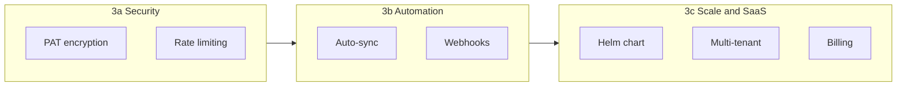

# Implementation Phases

This document is the **line to follow** — each phase builds on the previous one. Check off items as they ship.

---

## Phase 0 — Foundation ✅ Complete

Scaffolding and core pipeline infrastructure.

- [x] npm workspaces monorepo (`apps/web`, `apps/worker`, `packages/db`, `packages/shared-types`, `packages/metrics`)
- [x] Root `docker-compose.yml` (Postgres, Redis, Ollama; web/worker via `production` profile)
- [x] Prisma schema + initial migration
- [x] BullMQ sync worker with GitLab client
- [x] Vitest + MSW test foundation
- [x] Production Dockerfiles (web standalone, worker esbuild bundle)

---

## Phase 1 — MVP (Core product)

**Goal:** A team can connect a GitHub or GitLab project, sync issues, and see triage metrics on a dashboard.

> **Verified:** GitHub + GitLab sync, dashboard overview, ghost/zombie/milestone decay — working end-to-end in local dev (June 2026).

### Step 3 — Web API & sync trigger ✅

- [x] Add `@triage-ops/db` dependency to `apps/web`
- [x] API route: `GET/POST /api/connections` — register VCS connection (GitHub or GitLab)
- [x] API route: `GET/POST /api/projects` — register project under a connection
- [x] API route: `POST /api/projects/[id]/sync` — create `SyncRun`, enqueue `gitlab-sync` job
- [x] API route: `GET /api/projects/[id]/sync-runs` — list sync history
- [x] Shared enqueue helper using BullMQ `Queue` from web
- [x] Vitest tests for API validation helpers
- [x] Full route-handler tests with mocked Prisma + queue

### Step 3b — GitHub integration ✅

- [x] `VcsConnection` model with `provider: GITLAB | GITHUB`
- [x] GitHub REST client (`/repos/{owner}/{repo}/issues`)
- [x] Provider routing in sync worker
- [x] `gitlabIssueId` as `BigInt` (GitHub global IDs exceed 32-bit)
- [x] UI: provider picker, `owner/repo` project registration

### Step 4 — Triage metrics engine ✅

- [x] `packages/metrics` with pure functions:
  - `countGhostIssues(issues, thresholdDays)`
  - `countZombieIssues(issues, thresholdDays)`
  - `getMilestoneDecay(milestones, issues)`
- [x] TDD: unit tests for each metric (zero matches, boundary dates, empty input)
- [x] API route: `GET /api/projects/[id]/metrics` — returns metric summary JSON
- [x] Dashboard overview counts (total/open/closed issues, milestones)

### Step 5 — Dashboard UI (Shadcn) ✅

- [x] Install and configure Shadcn UI in `apps/web`
- [x] Layout shell: sidebar navigation, project selector
- [x] Page: **Connections** — list / add GitHub or GitLab connections
- [x] Page: **Projects** — list registered projects, sync button + last sync status
- [x] Page: **Dashboard** — overview + triage metric cards + issue/milestone tables
- [x] Loading and error states for interactive forms
- [x] Configurable metric thresholds in UI (per-project settings on dashboard)

### Step 6 — Developer experience ✅

- [x] Seed script: sample connections + projects (`packages/db/src/seed.ts`)
- [x] GitLab seed script: milestones/issues for metrics + LLM test data (`npm run gitlab:seed`)
- [x] Worker sync upserts milestones from issue payload (title, due date, state)
- [x] Worker sync upserts labels
- [ ] Encrypt `accessToken` at rest — **shipped Phase 3a** (`TOKEN_ENCRYPTION_KEY`); Step 6 checkbox kept for historical trace
- [x] Update root `README.md` to point to `docs/`
- [x] Root `.env` loading for Prisma, web, and worker dev scripts

### Step 7 — MVP hardening — partial

- [x] End-to-end smoke test script (register → sync → metrics) — `npm run test:e2e`
- [x] Docker Compose full-stack verification (`npm run docker:up:all` + migrate) — `npm run docker:verify`
- [x] Basic CI: lint + test + web build on push (GitHub Actions)
- [x] Review [MVP Definition of Done](./mvp-definition-of-done.md) — formal sign-off

### Step 8 — Authentication & access control ✅

> OAuth login via Auth.js. Disabled by default locally (`AUTH_DISABLED=true`). Required before exposing the instance beyond local dev.

- [x] User sign-in via GitHub or GitLab OAuth (configurable per deployment)
- [x] Session management (HTTP-only cookies via Auth.js + Prisma adapter)
- [x] Protect all `/api/*` routes and dashboard pages (proxy)
- [x] `userId` on `VcsConnection` with `AUTH_DATA_SCOPE=shared|per_user`
- [x] Email/domain allowlist for on-prem (`ALLOWED_EMAIL_DOMAINS`, `ALLOWED_EMAILS`)
- [x] Document auth setup in `docs/running-the-app.md`
- [x] Unit test: unauthenticated API session returns 401 when auth enabled

**Out of scope for Step 8:** multi-tenant billing, enterprise SSO (direct IdP). **RBAC, admin UI, audit log, rollback** → [Phase 4](./phases.md#phase-4--governance-admin--operations-planned).

---

## Phase 2 — LLM-assisted triage ✅

**Goal:** Privacy-first local LLMs identify duplicates and draft missing descriptions.

> Ollama container starts with `npm run docker:up`. Analysis runs via dashboard **Run analysis**; suggestions are reviewed before apply.

### Step 9 — Ollama integration ✅

- [x] Ollama client wrapper with health check (`/api/tags`, `/api/chat`, `/api/embed`)
- [x] New BullMQ queue: `llm-analysis`
- [x] Job: scan open issues for likely duplicates (embedding cosine similarity ~0.82)
- [x] Job: draft description text for issues with empty `description`
- [x] Store LLM suggestions in new `IssueSuggestion` table (human review required before apply)
- [x] Dashboard panel: review / dismiss / apply suggestions

### Step 10 — Safety & isolation ✅

- [x] LLM jobs run only against local DB copies (never send raw tokens to Ollama)
- [x] Rate limiting on LLM queue concurrency (`LLM_WORKER_CONCURRENCY=1` default)
- [x] Audit fields on applied suggestions (`reviewedAt`, `appliedAt`, `LlmAnalysisRun` history)

---

## Phase 2.5 — VCS write-back ✅

**Goal:** When users **Apply** AI suggestions, push changes to GitLab/GitHub and sync local Postgres state.

### Step 11 — Async write-back worker ✅

- [x] `IssueSuggestionStatus`: `APPLYING`, `APPLY_FAILED`; `writeBackError` audit field
- [x] BullMQ queue: `vcs-writeback` (`WriteBackJobPayload`)
- [x] GitLab write client: update description, add note, close issue
- [x] GitHub write client: update body, comment, close as duplicate
- [x] Duplicate policy: lower IID canonical; comment both issues; close duplicate
- [x] Worker acquires `sync:{projectId}` lock; patches local `Issue` rows on success
- [x] Web: Apply → `APPLYING` + enqueue; PATCH returns **202**; retry from `APPLY_FAILED`
- [x] Dashboard: applying / failed / retry UX; poll until write-back completes

---

## Phase 3 — Production infrastructure (post-MVP)

**Goal:** Harden and automate deployments for long-running intranet/production use. Split into three coherent tracks — implement **3a + 3b** first for most teams; **3c** only when you need Kubernetes or SaaS.

### Phase 3a — Security & ops minimum ✅ (shipped June 2026)

| Item | Status | Notes |
|------|--------|-------|
| Token encryption at rest | ✅ | `TOKEN_ENCRYPTION_KEY` + `sealAccessToken` / `openAccessToken` in `@triage-ops/db`; legacy plain tokens still readable |
| HTTPS + auth checklist | ✅ | Documented in [security.md](./security.md) — ops, not code |

| Item | Status | Effort |
|------|--------|--------|
| API rate limiting | [x] | **~2–3 days** — middleware on `/api/*` (Redis-backed, env-configurable) |

| Item | Status | Effort |
|------|--------|--------|
| Enterprise SSO (direct SAML/OIDC) | [ ] | **~1–2 weeks** — only if GitLab/GitHub OAuth upstream is insufficient |

### Phase 3b — Sync automation ✅ partial (June 2026)

| Item | Status | Notes |
|------|--------|-------|
| Per-project auto-sync | ✅ | `autoSyncEnabled` + `autoSyncIntervalMinutes` on `Project`; BullMQ repeatable `auto-sync` queue; toggle on Projects page |
| Scheduler env | ✅ | `AUTO_SYNC_SCHEDULER_ENABLED`, `AUTO_SYNC_TICK_MINUTES` |

| Item | Status | Effort |
|------|--------|--------|
| Webhook-triggered sync | [ ] | **~3–5 days** — GitHub/GitLab issue events → enqueue sync; signature verification |

### Phase 3c — Deployment & scale (optional)

| Item | Status | Effort | When you need it |
|------|--------|--------|------------------|
| Self-hosted install guide (Compose) | [ ] partial | **~1 day** — [intranet-rollout.md](./intranet-rollout.md) | Any production deploy |
| **Product distribution (image-based)** | [ ] planned | **~3–5 days** | Before external pilot — [production-readiness.md](./production-readiness.md) |
| `docker-compose.prod.yml` (image pins, no `build:`) | [ ] | part of distribution | Product releases |
| CI: push `web` + `worker` images to private GHCR on tag | [ ] | part of distribution | Product releases |
| Install bundle (Compose + `.env.example` + docs, no source) | [ ] | **~1 day** | First external pilot |
| **Helm chart** (Kubernetes) | [ ] | **~1–2 weeks** | K8s cluster, GitOps, multiple envs — *not needed for Docker Compose intranet* |
| Multi-tenant (orgs, teams) | [ ] | **~2–4 weeks** | Shared instance for many teams; overlaps [Phase 4](./phases.md#phase-4--governance-admin--operations-in-progress) |
| Billing / license tier | [ ] | **~2+ weeks** | SaaS or commercial on-prem only |

**Helm in one sentence:** A packaged install for Kubernetes (like `docker-compose.yml`, but for K8s). Skip until you actually run on K8s.

---

## Phase 4 — Governance, admin & operations (in progress)

**Goal:** Operate TriageOps with **roles**, **auditability**, and **reporting** when multiple users work with different responsibilities. An admin provisions access; users sign in via GitHub/GitLab OAuth (corporate SSO upstream). Suited for intranet teams that outgrow “everyone can do everything.”

**Product decisions (bootstrap + distribution):** [on-prem-product.md](./on-prem-product.md)

> **Not required for small intranet MVP** (Phases 0–2.5 + allowlist). Becomes important when operators, reviewers, and admins need separated duties.

### Step 12 — RBAC foundation — partial (June 2026)

- [x] `UserRole` enum (`ADMIN`, `LEAD`, `OPERATOR`, `VIEWER`)
- [ ] Optional `ProjectMembership` (user ↔ project + role override)
- [x] Permission matrix for API actions: manage connections, sync, analyze, apply, dismiss, admin
- [x] Enforce permissions in route handlers + `lib/auth/` helpers (not UI-only)
- [ ] Bootstrap first admin via setup wizard (replaces env-only `ADMIN_EMAILS` as primary path) — see [Step 12b](#step-12b--instance-bootstrap--closed-registration-planned)

**Suggested roles:**

| Role | Typical permissions |
|------|---------------------|
| Admin | Users, roles, connections, projects, settings |
| Lead | Run analysis, review suggestions, approve/dismiss |
| Operator | Apply write-back (description / duplicate), no connection management |
| Viewer | Read metrics and suggestions only |

### Step 12b — Instance bootstrap & closed registration — partial (June 2026)

> **Chosen model:** [on-prem-product.md § Bootstrap](./on-prem-product.md#chosen-approach--instance-bootstrap-auth) — first OAuth login = first admin; admins can promote more admins; closed registration after setup.

- [x] `setupComplete` flag (`AppSettings` model)
- [x] `/setup` flow on fresh install; redirect until complete
- [x] First OAuth sign-in → `ADMIN` + mark setup complete
- [x] **Closed registration:** admin pre-provisions email + role; unknown emails rejected at sign-in
- [x] Admin UI: invite / provision user (`POST /api/admin/users`, pending invites table)
- [x] Production guard: refuse `AUTH_DISABLED=true` when `NODE_ENV=production` (`instrumentation.ts`)
- [x] `dev@local` / `ensureDevUser` only with explicit dev bypass — blocked in production
- [x] Keep `ADMIN_EMAILS` as optional automation fallback on sign-in
- [x] Tests + migration backfill for existing installs

### Step 13 — Admin dashboard — partial (June 2026)

- [x] `/admin` area (Admin role only): users, roles
- [x] Audit events list (read-only)
- [ ] Connections overview (PAT metadata only — never show tokens)
- [ ] Auth status: providers, allowlist summary, setup state, active sessions count
- [ ] Background jobs: recent sync / LLM / write-back runs and failures
- [ ] **Invite user** form (email + role) for closed registration

### Step 14 — Audit log — partial (June 2026)

- [x] `AuditEvent` model: `userId`, `action`, `resourceType`, `resourceId`, `metadata`, `createdAt`
- [x] Log: suggestion apply/dismiss, sync trigger, analysis clear, connection/project CRUD, role changes
- [ ] `appliedByUserId` on `IssueSuggestion` (link write-back to actor)
- [x] Admin UI: audit trail (basic list)

### Step 15 — Change log & affected issues

- [ ] Unified **changes** view: all applied suggestions with issue IIDs, VCS links, actor, timestamp
- [ ] Filter by project, type (DESCRIPTION / DUPLICATE), user, date range
- [ ] Export (CSV) for compliance / handover

### Step 16 — Impact reporting (timeline)

- [ ] Periodic **metric snapshots** per project (ghost, zombie, milestone decay, open count)
- [ ] Dashboard timeline: “since campaign start” — issues touched, duplicates closed, descriptions added
- [ ] Delta vs baseline for management reporting

### Step 17 — Rollback (write-back undo)

- [ ] Store **previous state** before apply (e.g. `previousDescription`, duplicate close metadata)
- [ ] **DESCRIPTION revert:** worker job restores prior body on VCS + local `Issue`
- [ ] **DUPLICATE revert (partial):** reopen issue via VCS API; document manual comment cleanup
- [ ] UI: “Revert” on eligible change-log entries (permission: Lead or Admin)
- [ ] Optional queue: `vcs-rollback` (same lock conventions as write-back)

---

## Suggested immediate next steps

Phases 0–2.5 and Phase 1 MVP are complete (June 2026).

**Active tracking:** use the checkbox list in [**Completion Roadmap**](./completion-roadmap.md) — workstreams, build order, and v1.0 definition of done.

Legacy quick picks by deployment maturity:

1. **Phase 4 — Bootstrap + governance** — [setup wizard + closed registration](./on-prem-product.md#chosen-approach--instance-bootstrap-auth); finish admin invite UX
2. **Small intranet team (interim)** — `AUTH_DISABLED=false`, mandatory allowlist, `TOKEN_ENCRYPTION_KEY`, optional `AUTO_SYNC_SCHEDULER_ENABLED=true`
3. **Phase 3b** — webhooks when near-real-time sync matters
4. **Phase 3c — Product distribution** — [production-readiness.md § Workstream 1](./production-readiness.md#1-product-distribution--essential-for-gate-b) before first external pilot
5. **Phase 3c** — Helm/K8s or multi-tenant only when required
