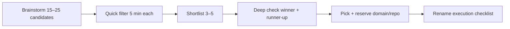

# Product naming — Gridnull

Last updated: June 2026

**Status:** **Name chosen — Gridnull.** Technical rename executed in-repo (packages `@gridnull/*`, `GRIDNULL_*` env, stale/stuck metrics). Register domains + rename GitHub repo (`ktauchert/triage-ops` → `ktauchert/gridnull`) before external pilot.

**Work summary:** [rename-to-gridnull.md](./rename-to-gridnull.md) — full chronicle of what changed (code, DB, Docker, migrations).

## Chosen name: Gridnull

| Layer | Target |
|-------|--------|
| Product | **Gridnull** |
| Repo slug | `gridnull` |
| npm scope | `@gridnull/*` |
| GHCR images | `gridnull-web`, `gridnull-worker` |
| Install ZIP | `gridnull-install-x.y.z.zip` |
| Env prefix (install) | `GRIDNULL_*` |

**Tagline (optional):** *Find the nulls. Fix what's stale. Unstick the rest.*

**Wordplay:** **Grid** (structure, dashboard, scan lines) + **null** (empty signal, no activity, the cell that stopped reporting). Says something without spelling it out — fits simple cyberpunk tone.

**Metric vocabulary (shipped):** ghost → **stale**, zombie → **stuck** (code, API, UI, DB columns).

### Deep check (2026-06-29)

**Verdict: GO** — register primary domains soon.

| Check | Result | Notes |
|-------|--------|-------|
| `gridnull.com` / `.dev` / `.io` / `.app` / `.net` / `.co` | **NXDOMAIN** | `host` + no HTTPS |
| GitHub `gridnull` org | **Not found** | API 404 |
| GitHub search `gridnull` | **0 repos** | |
| `ktauchert/gridnull` | **Available** | Repo rename from `triage-ops` |
| npm `gridnull` / `@gridnull/*` | **0 packages** | |
| Docker Hub `gridnull/*` | **Empty namespace** | |
| Exact product “Gridnull” | **None** | Web + GitHub |

**Adjacent (not blockers):**

| Name | Overlap | Risk |
|------|---------|------|
| [Null Grid Ltd](https://opengovuk.com/company/16449497) (UK, May 2025) | “Null Grid” reversed; Shelton St shell address | Low — no visible product |
| R `grid.null()` | Graphics placeholder | Technical noise only |

**Recommended actions:**

1. Register **`gridnull.com`** + **`gridnull.dev`** (user action).
2. Rename repo `ktauchert/triage-ops` → `ktauchert/gridnull` after merge.
3. First tagged release with `gridnull-*` GHCR images + install ZIP.

**Why we left TriageOps:** [triageops.com](https://triageops.com/) and [triageops.dev](https://triageops.dev/) use the same brand for unrelated products; GitLab ships an internal project named [`triage-ops`](https://gitlab.com/gitlab-org/quality/triage-ops). Easy to confuse in search and sales.

**Explored but not chosen:** Wiregrave (grave too dark), Gilgamesh/epic round, Gridify (heavy .NET collision), Gridrunner (retro game), nautical shortlist — see sections below for history.

---

## Naming process (recommended)

Do **not** deep-check 50 names one-by-one. Do **not** pick a name without any check.

### Efficient workflow

| Step | What | Time |
|------|------|------|
| 1. Brainstorm | Wordplay, acronyms, metaphors (stale/stuck/stale backlog, on-prem, shipyard) | 1–2 h human |
| 2. Quick filter | Per name: web search + `github.com/<name>` + obvious domain | ~3 min × 15 ≈ 45 min |
| 3. Shortlist | Keep 3–5 with no direct product collision | — |
| 4. Deep check | Domains (`.com`, `.dev`, `.io`), npm scope, GHCR, EU/US trademark rough search, App Store if relevant | 1–2 h |
| 5. Decide | One product name = repo slug = image prefix (kebab-case) | — |
| 6. Execute | See [Rename checklist](#rename-checklist) below | 1–2 days engineering |

**Rule:** Product name, public repo slug, and Docker image prefix should match (e.g. `Siltline` → `siltline` → `ghcr.io/.../siltline-web`).

---

## Candidate shortlist (June 2026 — quick filter only)

Preliminary web/GitHub scan. **Not** legal clearance. **Not** domain registration verified.

| Name | Acronym / wordplay | Fit | Quick check | Risk |
|------|-------------------|-----|-------------|------|
| **Siltline** | **SILT** — Synced Issue Local Triage; silt = sediment at the bottom (stale issues settle) | Strong metaphor, pronounceable, on-prem vibe | No issue-triage product found; `silt.app` is unrelated (AI canvas) | Low–medium; verify `siltline.com` / GitHub `siltline` |
| **Scupper** | Ship deck drain → “drain the backlog”; **SCUPPER** — Sync, Classify, Undo duplicates, Project triage, Evaluate, Review | Memorable verb energy | Old Windows utility + archive OS; **no** issue-triage dashboard | Medium; generic word |
| **Rotyard** | **ROTYARD** — Repository Old-Ticket Yard | Invented, unique spelling | No product hit (`railyard` is different — AI orchestration) | Low; slightly informal |
| **PRUNE** | **PRUNE** — Project Repository Unblocking & Normalization Engine | Verb = prune stale issues | Common English word; many npm packages use “prune” | Medium; hard to own in search |
| **Barnacle** | Issues “stuck” to milestones; **BARNACLE** — Backlog Assessment & Repository Normalization for Classification & Labelling Engine | On-theme for milestone decay | Many unrelated `barnacle*` repos; no exact match | Medium; crowded prefix |
| **Holdfast** | Issues that won’t let go (zombies); **HOLDFAST** — … | Matches zombie metric | New self-hosted **observability** product `holdfast` (Mar 2026) | **High** — skip |
| **Drydock** | Maintenance bay for repos | Great metaphor | **Taken** — multiple GitHub issue→PR tools named Drydock | **High** — skip |
| **Keelson** | Structural keel support (on-prem anchor) | Nautical | `keelson` maritime SDK, `keelson.app`, `keelson.tech` | **High** — skip |
| **Mothball** | To mothball = park stale work | Perfect for stale/stuck | AWS archival tools `MothBall`, `s3mothball` | Medium–high |

### Rejected for this product (reference)

| Name | Reason |
|------|--------|
| Gridnull | Domains taken; GitLab `gridnull`; AI consultancies |
| GitLab Lens / GitLens-adjacent | Confusion with GitLens (GitKraken); misleading (GitHub too) |
| Backlog*, IssueDeck, issy, grite | Active or adjacent issue/backlog products |
| Wraith, Ghoststack | AI agent / credential products |
| Ferrous | Ferrous Systems (Rust consultancy) |

---

## Favorites to decide between

1. **Siltline** — best balance of unique coinage + metaphor + professional tone.
2. **Rotyard** — most unique invented word; slightly more “internal codename” feel.
3. **Scupper** — strongest action verb; check trademark/domain harder before committing.

**Next step for owner:** Pick 1–3 from above → we run deep check (domains, `ktauchert/<slug>`, npm `@<slug>`, GHCR) → finalize → execute rename.

---

## Rename checklist (when name is chosen)

Execute in one release window; keep old GHCR tags pullable for one version if customers already exist.

- [ ] GitHub: rename repo or create `ktauchert/<new-slug>` + archive old
- [ ] npm workspaces: `@gridnull/*` → `@<new-slug>/*` (all `package.json`, imports, lockfile)
- [ ] Docker: `apps/*/Dockerfile`, `docker-compose*.yml`, GHCR image names
- [ ] CI: `.github/workflows/release.yml` bundle dir + image tags
- [ ] Install bundle: folder name, `.env.example` vars (`GRIDNULL_*` → new prefix)
- [ ] UI strings, `layout.tsx` title, `/setup`, legal docs (EULA product name)
- [ ] Docs: `docs/`, `install/`, `AGENTS.md`, README
- [ ] Redirect note in old repo README (if archived): “Moved to …”
- [ ] Customer comms: upgrade path, new image names, no data migration needed (Postgres unchanged)

**Suggested timing:** After current release pipeline is green, **before** first external pilot or landing page domain purchase.

---

## Tracking

| Date | Note |
|------|------|
| 2026-06-29 | Decision recorded: rename planned. Initial candidate shortlist + quick availability scan. |
| 2026-06-29 | **Nautical theme** parked (user liked direction; no pick yet). **Cyberpunk theme** — second brainstorm + quick filter added below. |
| 2026-06-29 | **Gridnull** chosen — simple cyberpunk (grid + null); stale/stuck metrics; technical rename in-repo. Wiregrave/Gilgamesh/grid round parked. |
| 2026-06-29 | **Wiregrave** explored then rejected (grave too dark). GlitchGrave rejected (glitchgrab collision). |
| 2026-06-29 | **Deep check passed (GO).** Domains `.com`/`.dev`/`.io`/`.app` NXDOMAIN; GitHub/npm/Docker clear. |

---

## Theme: Nautical (parked — still in play)

User feedback: nautical metaphors resonated; keep on the shortlist even while exploring other themes.

| Name | Acronym / wordplay | Quick check | Status |
|------|-------------------|-------------|--------|
| **Siltline** | SILT — Synced Issue Local Triage | No triage product | Favorite |
| **Rotyard** | ROTYARD — Repository Old-Ticket Yard | Unique coinage | Favorite |
| **Scupper** | Deck drain → drain backlog | No triage dashboard | Runner-up |

See [Candidate shortlist (nautical)](#candidate-shortlist-june-2026--quick-filter-only) above for full table.

---

## Theme: Cyberpunk (June 2026 — quick filter only)

Vibes: netrunner decks, flatlined tickets, stale/stuck issues, chrome sprawl, local ICE (on-prem), neon graveyards, bit rot. **Not** direct CP2077/GitLens/Lens naming.

Preliminary web/GitHub scan. **Not** legal clearance. **Not** domain registration verified.

### Top picks (cyberpunk)

| Name | Acronym / wordplay | Fit | Quick check | Risk |
|------|-------------------|-----|-------------|------|
| **Wiregrave** | Where dead issues go — net **wire** + **grave**; **WIREGRAVE** — Wired Issue Repository Evaluation, Ghost Removal, And VCS Enforcement | Strong CP tone, on-prem “offline net”, stale/stuck metric | No software product found (industrial Danish term only) | **Low** — verify domain/GitHub |
| **Glitchpile** | Corrupted backlog heap; **GLITCHPILE** — GitLab/GitHub Issue Triage, Classification & Heuristics Pipeline for Local Evaluation | Very cyberpunk, matches stale/duplicate chaos | No product named Glitchpile (`Glitchward` is different — AI security) | Low–medium |
| **Jackwire** | Neural **jack** + **wire**; **JACKWIRE** — Just-in-time Analysis & Classification Kit for Wired Repositories and Issues | Netrunner energy, short repo slug | No product hit (WireUI / JACK audio unrelated) | Low–medium |
| **Flatwire** | **Flatline** + wire (ticket flatlined but still connected); **FLATWIRE** — Flatline Lint Analysis for Tickets — Wired Issue Repository Engine | Gibson/CP “flatline” without using the word | No `Flatwire` product (`flatware`, `depwire` differ) | Low–medium |
| **Neongrave** | Neon-lit graveyard for zombie issues; **NEONGRAVE** — Networked Evaluation Of Normalized Ghost Repository And VCS Entities | Visual brand potential (dashboard dark mode) | No software product (`Neon GraVel` game = different spelling) | Low–medium |

### Solid alternates (cyberpunk)

| Name | Acronym / wordplay | Caveat |
|------|-------------------|--------|
| **Synthyard** | AI **synth** + junk **yard** for old tickets; **SYNTHYARD** — Synced Yield Normalization & Triage for Your Archived Repository Data | DIY synth “Stickney Synthyard” only; no dev product |
| **Ghostsector** | Abandoned sector of the backlog; **GHOSTSECTOR** — … | No `ghostsector` repo found; crowded `ghost*` security space |
| **Glitchyard** | Glitch + yard | Near **Glitchward** (LLM security) — phonetic confusion risk |

### Rejected (cyberpunk round — reference)

| Name | Reason |
|------|--------|
| ICEpick / ICEyard | `hatchet-dev/icepick` AI agents; Iceyard = jewelry brand; Zeroc-ICE / ICE Mortgage |
| Ghostline | Anonymous reporting platform (has “triage” in marketing) |
| Deadstack | [deadstack.co](https://www.deadstack.co/) — startup failure archive (Feb 2026) |
| Flatstack | Flatstack dev agency since 2005 |
| Engram | Major AI agent memory products (4k+ stars, Mar 2026) |
| Netgrave | CVE exploit tool for IP cameras — toxic association |
| Coldstack | ColdStack decentralized cloud ([coldstack.io](https://coldstack.io/)) |
| Neonstack | Neon DB + Stack Auth templates |
| Chromewight / Chromewright | Browser automation MCP (2026) |
| Phantom / Phantomline | ghostwright/phantom AI co-worker, phantompane/phantom worktrees |
| Snowcrash / Sprawlheap | Snow Crash Labs AI safety, Snowcrash Inc. music AI |
| Zerodeck | ZeroDeck IT consultancy (Mexico) — not software, but name taken |
| Nullsector | Too close to Nullplatform DevOps |
| Deckline | Phonetically near Cline CLI ecosystem |

### Cyberpunk favorites to decide between

1. **Wiregrave** — most unique + strongest metaphor (cemetery for dead tickets).
2. **Glitchpile** — loudest cyberpunk identity; good for dark UI brand.
3. **Jackwire** — shortest, most netrunner; acronym slightly forced.

**Cross-theme note:** Nautical **Siltline** and cyberpunk **Wiregrave** both score low collision — different aesthetics, similar “stale backlog” story.

### Hybrid candidate: GlitchGrave (user proposal)

Mashup of **Glitchpile** + **Wiregrave**. Quick filter June 2026:

| Aspect | Assessment |
|--------|------------|
| Metaphor | Strong — glitched backlog + graveyard for dead/zombie issues |
| Acronym | **GLITCHGRAVE** — GitLab/GitHub Issue Classification & Heuristics for Ghost Repository Analysis, VCS Evaluation |
| Exact product | None named GlitchGrave |
| **glitchgrab** ([glitchgrab.dev](https://glitchgrab.dev/)) | **High risk** — GitHub + AI issue triage/dedup (Mar 2026); slug `glitchgrave` vs `glitchgrab` one keystroke apart |
| GlitchGr4ve | Vaporwave artist (“Neon Graveyard”) — low B2B risk, noisy search |
| `ul0gic/grave` | CLI for abandoned GitHub repos — adjacent “dead repo” metaphor |

**Verdict:** Great creative fit; **not recommended** as primary brand until glitchgrab collision assessed in deep check. Safer cyberpunk picks: **Wiregrave** or **Glitchpile** (more distinct from glitchgrab).
