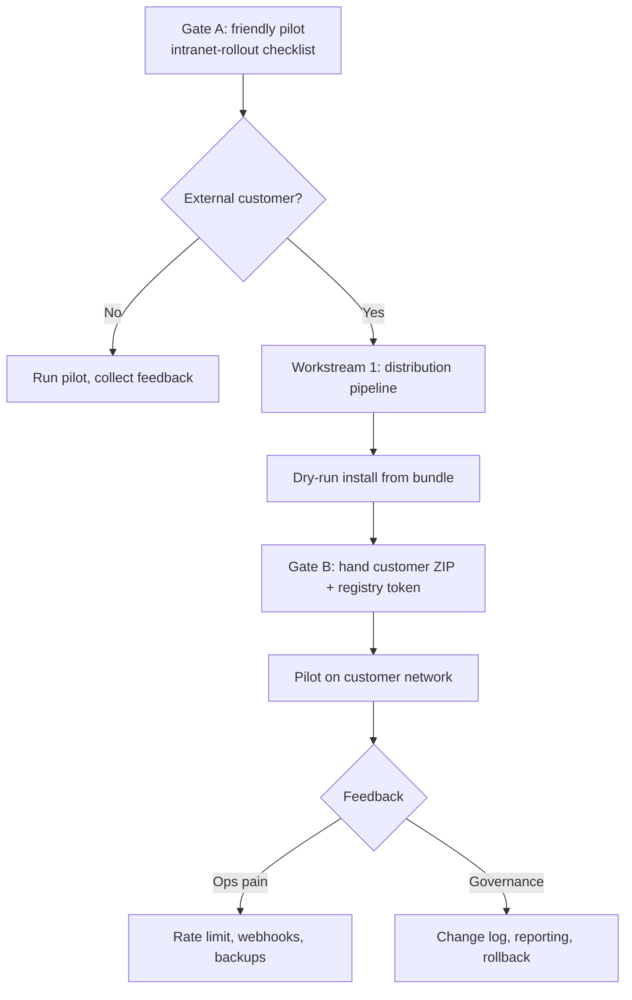

# Production Readiness

Last updated: June 2026

This document is the **single checklist** for taking Gridnull from “works great in dev” to **deployable for customers** who configure and run it — without cloning the source repo.

Use it when you return from a break or start a pilot. For day-to-day dev, see [Running the App](./running-the-app.md). For install steps once shipped, see [Intranet Rollout](./intranet-rollout.md).

**Related decisions:** [On-Prem Product Model](./on-prem-product.md) · [Security](./security.md) · [Phases](./phases.md)

---

## Where we are today

| Area | Status | Notes |
|------|--------|-------|
| Core product (sync, metrics, LLM, write-back) | ✅ Ready | Phases 0–2.5 complete |
| Auth + RBAC + admin + audit | ✅ Mostly ready | Roles enforced on API; admin UI shipped |
| Instance bootstrap (`/setup`, closed registration) | ✅ Ready | First OAuth login = admin; invite flow |
| Dashboard (home → project → admin) | ✅ Ready | See [dashboard-restructure.md](./dashboard-restructure.md) |
| PAT encryption at rest | ✅ Ready | Set `TOKEN_ENCRYPTION_KEY` in prod |
| Auto-sync scheduler | ✅ Ready | Optional; `AUTO_SYNC_SCHEDULER_ENABLED=true` |
| CI (test, lint, build) | ✅ Ready | GitHub Actions on push/PR |
| Production Dockerfiles | ✅ Ready | Web standalone + worker esbuild bundle |
| **Image-based customer install** | ✅ Ready | `docker-compose.prod.yml` + GHCR images on tag |
| **Install bundle for customers** | ✅ Ready | Release ZIP via `.github/workflows/release.yml` |
| API rate limiting | ✅ Ready | Redis-backed; `RATE_LIMIT_*` env vars — [security.md](./security.md#rate-limiting) |
| Webhook-triggered sync | ❌ Open | Phase 3b — auto-sync is enough for v1 pilot |
| Change log / reporting / rollback | ❌ Open | Phase 15–17 — post-pilot |
| Helm / K8s chart | ❌ Open | Only if customer requires K8s |

**Bottom line:** The app is **pilot-capable** once ops config is correct. **Product distribution** (images + install bundle) is shipped; remaining gaps are **ops validation** (clean-VM dry-run, backup/restore) and **governance depth** (change log, rollback).

---

## Two release gates

### Gate A — Internal / friendly pilot (you host or trusted IT)

Minimum to run on a real intranet VM with real users:

- [ ] `AUTH_DISABLED=false`, strong `AUTH_SECRET`
- [ ] `TOKEN_ENCRYPTION_KEY` set (32-byte base64)
- [ ] OAuth apps registered (GitHub/GitLab) with production callback URL
- [ ] Email allowlist or closed registration (invite users before login)
- [ ] HTTPS reverse proxy in front of web (nginx / Caddy / Traefik)
- [ ] Postgres + Redis **not** exposed to the internet
- [ ] Ollama models pulled on host (`llama3.2:3b`, `nomic-embed-text`)
- [ ] Backup plan for Postgres volume
- [ ] Run through [Intranet Rollout](./intranet-rollout.md) acceptance checklist

**Can still use:** `git clone` + `docker compose --profile production` on the pilot server. Acceptable for first friendly pilot only.

**Est. effort:** ~1–2 days ops work (no code), assuming intranet-rollout checklist is followed.

### Gate B — External customer (no source access)

Minimum to hand a customer an install they can run without your repo:

- [ ] All Gate A items
- [x] `docker-compose.prod.yml` — `image:` pins only, no `build:`
- [x] CI publishes `web` + `worker` images on semver git tag
- [x] Private container registry (GHCR or customer mirror)
- [x] Install bundle (ZIP): compose + `.env.example` + `install.md` + license
- [x] Customer docs: pull → configure → migrate → up → `/setup`
- [x] Documented upgrade path: `pull` → `migrate` → `up -d`
- [x] Clean-VM install procedure documented (see below) — run on a fresh VM before first external customer

**Est. effort:** ~3–5 days engineering (distribution pipeline + docs + dry-run).

### Clean-VM install dry-run (Gate B)

Validate a release bundle **without** the monorepo on a fresh Linux VM with Docker:

1. Download `gridnull-install-x.y.z.zip` from the GitHub Release (or use a local build of the bundle).
2. Unzip and `cd` into the bundle directory.
3. Configure `.env` from `.env.example` (OAuth credentials optional for infra-only smoke).
4. From the monorepo checkout (or copy the script into the bundle), run:
   ```bash
   scripts/verify-prod-install.sh /path/to/gridnull-install-x.y.z
   ```
   The script pulls images, runs migrations, starts web + worker, and curls `/login` or `/setup`.
5. Open `http://<vm>:3000/setup`, complete OAuth bootstrap, and invite a test user in Admin → Users.

Record the VM image, bundle version, and any friction in your pilot notes before handing the bundle to customers.

---

## Workstreams (what to build later)

### 1. Product distribution — **essential for Gate B**

| Task | Owner | Est. | Done |
|------|-------|------|------|
| Add `docker-compose.prod.yml` at repo root | Dev | 0.5 d | [x] |
| Pin image names/tags (`ghcr.io/ktauchert/gridnull-web`, `…-worker`) | Dev | 0.5 d | [x] |
| CI job: on tag `v*`, build + push both images | Dev | 1 d | [x] |
| Create `install/` template folder for release ZIP | Dev | 0.5 d | [x] |
| GitHub Release workflow: attach install bundle | Dev | 0.5 d | [x] |
| Registry access: per-customer read token or org token | Ops | 0.5 d | [x] |
| Dry-run install on clean VM from bundle only | Dev/Ops | 1 d | [x] (procedure documented; execute before first customer) |
| Update [intranet-rollout.md](./intranet-rollout.md): product path = primary | Docs | 0.5 d | [x] |

**Deliverable:** Customer receives `gridnull-install-x.y.z.zip`, never clones git.

See [on-prem-product.md § Production distribution](./on-prem-product.md#chosen-approach--production-distribution) for target layout.

### 2. Security & ops minimum — **essential for Gate A**

| Task | Est. | Done |
|------|------|------|
| Production `.env` template (secrets called out, no dev defaults) | 0.5 d | [x] (`.env.production.example`) |
| Verify `instrumentation.ts` blocks `AUTH_DISABLED` in production | — | [x] |
| Verify empty allowlist denies sign-in after setup | — | [x] |
| Document PAT scope requirements (GitHub/GitLab) | — | partial |
| Postgres backup + restore procedure | 0.5 d | [ ] |
| Log retention / disk monitoring for Ollama + Postgres | 0.5 d | [ ] |
| API rate limiting middleware | 2–3 d | [x] |

See [security.md](./security.md) for the full hardening checklist.

### 3. Governance depth — **post-pilot, not blocking v1**

| Task | Phase | When |
|------|-------|------|
| Change log + CSV export | 15 | Compliance / handover requests |
| Metric snapshots + impact timeline | 16 | Management reporting |
| Write-back rollback (description first) | 17 | When ops need undo |
| `ProjectMembership` (per-user project access) | 4 | Larger orgs, not SME intranet |
| Enterprise SSO (SAML/OIDC direct) | 3a | Only if GitHub/GitLab OAuth upstream insufficient |

### 4. Scale & automation — **only if pilot asks**

| Task | When |
|------|------|
| Webhook-triggered sync | Near-real-time sync requirement |
| Helm chart | Customer runs Kubernetes |
| Multi-tenant / billing | SaaS or shared commercial hosting |

---

## Recommended order when you pick this up



1. **Weekend / first session back:** Skim this doc + run Gate A checklist on a test VM (even if only you use it).
2. **If first customer is external:** Implement Workstream 1 (distribution) before handing anything over.
3. **During pilot:** Fix ops gaps (backups, monitoring); defer Phase 15–17 unless asked.
4. **After pilot sign-off:** Tag `v1.0.0`, publish images, ship install bundle as the supported path.

---

## Customer install preview (target state)

What a customer **will** receive (no monorepo):

```
gridnull-install-1.0.0/
├── docker-compose.prod.yml
├── .env.example
├── install.md
└── LICENSE.txt
```

What a customer **will not** receive:

- Git repository access
- `npm install` / Node.js on server
- Test suites, dev scripts, or source maps (minimize in prod builds if desired)

What **you** keep private:

- Monorepo, CI, issue tracker, release process
- Container registry write access

**Updates for customer:**

```bash
docker compose -f docker-compose.prod.yml pull
docker compose -f docker-compose.prod.yml --profile migrate run --rm migrate
docker compose -f docker-compose.prod.yml --profile production up -d
```

---

## Pre-pilot smoke checklist (30 minutes)

Run before any production URL is shared:

```bash
# Infra
npm run docker:up:all          # or prod compose on pilot host
npm run db:migrate:deploy

# App health
curl -sf http://localhost:3000/api/...   # or via HTTPS proxy
npm run test:e2e               # MSW smoke; uses Redis DB 15

# Auth
# - AUTH_DISABLED must be false
# - /setup works on fresh DB
# - Unknown email rejected after setup
# - Invited user can sign in

# Functional
# - Add connection (GitHub or GitLab PAT)
# - Register project → sync → metrics visible
# - Run analysis → suggestion → apply (if write-back in scope)
```

---

## Environment variables — production minimum

| Variable | Required | Notes |
|----------|----------|-------|
| `DATABASE_URL` | Yes | Strong password; internal network only |
| `REDIS_URL` | Yes | Not public |
| `AUTH_SECRET` | Yes | Random 32+ bytes |
| `AUTH_DISABLED` | Must be `false` | Blocked at startup in production |
| `AUTH_URL` | Yes | Public HTTPS URL (OAuth callbacks) |
| `AUTH_PROVIDERS` | Yes | `github`, `gitlab`, or both |
| `TOKEN_ENCRYPTION_KEY` | Strongly recommended | Encrypt PATs at rest |
| `ALLOWED_EMAIL_DOMAINS` or invites | Yes | Closed registration |
| `OLLAMA_HOST` | Yes | Internal; models pre-pulled |
| `AUTO_SYNC_SCHEDULER_ENABLED` | Optional | `true` for hands-off sync |

Full list: [current-state.md § Key environment variables](./current-state.md#key-environment-variables).

---

## Definition of done — “production ready for customers”

Check all before calling v1 shippable:

- [ ] Gate B distribution pipeline works end-to-end
- [ ] [Intranet Rollout](./intranet-rollout.md) completed on a clean VM from install bundle only
- [ ] [Security](./security.md) checklist signed off (HTTPS, secrets, network)
- [ ] Bootstrap + invite flow tested with a second real user
- [ ] Sync + analyze + apply tested against customer’s VCS (GitHub or GitLab)
- [ ] Backup/restore tested once
- [ ] Upgrade tested once (pull newer tag, migrate, restart)
- [ ] Support runbook: logs location, common failures, who to contact

---

## Open questions (decide during pilot)

| Question | Default recommendation |
|----------|------------------------|
| Public vs private source repo? | Private; customers get images only |
| License / activation key? | Defer until commercial tier — see [editions.md](./editions.md) |
| GitHub-only vs GitLab-only customer? | Support both; document OAuth + PAT per provider |
| Who hosts Ollama GPU? | CPU OK for pilot; document RAM (~8 GB+ with models) |
| Single admin vs multiple? | Multiple admins supported; document promotion in admin UI |

---

## Quick links

| Doc | Use when |
|-----|----------|
| [intranet-rollout.md](./intranet-rollout.md) | Installing on a company network |
| [on-prem-product.md](./on-prem-product.md) | Bootstrap + distribution decisions |
| [security.md](./security.md) | Hardening + reviewer FAQ |
| [phases.md](./phases.md) | Full roadmap with effort estimates |
| [running-the-app.md](./running-the-app.md) | Local dev + e2e troubleshooting |
