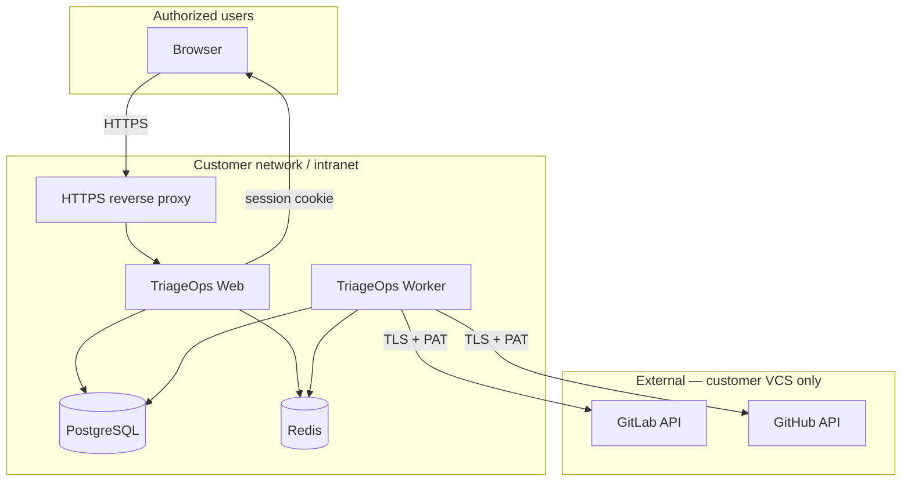

# Security

This document describes how TriageOps handles authentication, credentials, and data — written for **on-prem / intranet** deployments and for security reviewers evaluating the product before rollout.

**Summary:** TriageOps is designed to run **inside your network**. User login is OAuth-based with optional allowlists. VCS personal access tokens (PATs) are stored in your Postgres instance and used server-side only to sync issue metadata. **Production requires explicit hardening** (auth enabled, HTTPS, strong DB passwords, network isolation). Some MVP limitations (plain-text PAT storage) are documented below with mitigations and roadmap.

---

## Security model



| Boundary | What crosses it |
|----------|-----------------|
| User → TriageOps | HTTPS, OAuth login, HTTP-only session cookie |
| TriageOps → VCS | HTTPS only; PAT sent in `Authorization` / `PRIVATE-TOKEN` headers |
| TriageOps → third parties | **No** SaaS telemetry, analytics, or external AI in MVP (Ollama is local, Phase 2) |
| Data residency | All synced issue data stays in **your** Postgres |

---

## Authentication and access control

### Implemented

| Control | Detail |
|---------|--------|
| **Login** | Auth.js v5 — GitHub and/or GitLab OAuth (configurable via `AUTH_PROVIDERS`) |
| **Sessions** | JWT strategy, delivered as **HTTP-only** cookies (not accessible to browser JavaScript) |
| **Route protection** | Next.js `proxy.ts` blocks unauthenticated access to dashboard and `/api/*` |
| **API enforcement** | Route handlers call `requireApiSession()`; unauthenticated requests return **401** |
| **Allowlist** | Optional `ALLOWED_EMAIL_DOMAINS` / `ALLOWED_EMAILS` for on-prem (reject sign-in before session is created) |
| **Deployment profiles** | On-prem: `AUTH_DATA_SCOPE=shared` + GitLab OAuth + allowlist. Hosted solo: `per_user` isolation |
| **Dev bypass** | `AUTH_DISABLED=true` skips all auth — **must be `false` in production** |

### Corporate SSO (GitLab)

On-prem customers often use SSO into GitLab (Okta, Azure AD, etc.). TriageOps does **not** integrate with the IdP directly. Users sign in with **GitLab OAuth**; GitLab handles corporate SSO upstream. This is the recommended on-prem login path.

### Not implemented (out of scope for current release)

- Direct SAML/OIDC to corporate IdP (bypassing GitLab)
- Role-based access control (admin vs viewer)
- Per-action audit log UI
- API rate limiting

---

## VCS credentials (personal access tokens)

### How PATs are used

1. An authorized user adds a **connection** in the UI with a PAT.
2. The PAT is stored in `vcs_connections.accessToken` in Postgres.
3. Only **server-side** code reads the PAT:
   - Worker sync jobs (issue fetch)
   - Web API `remote-projects` listing
4. PATs are **never** returned in `GET /api/connections` responses.

Login OAuth tokens (Auth.js `accounts` table) are **separate** from sync PATs. Logging in does not grant VCS access without a connection PAT.

### Least-privilege scopes (recommended)

| Provider | Minimum scope for list + sync | Notes |
|----------|------------------------------|--------|
| **GitHub** | `repo` | Required for private repositories. Use `public_repo` only if all target repos are public. |
| **GitLab** | `read_api` | Read-only access to projects and issues — sufficient for triage sync |

Use **fine-grained** or **classic** PATs with the narrowest scope your organization allows. Rotate tokens on a schedule and when people leave the team.

### Known limitation: PAT storage at rest

**VCS PATs are stored as plain strings in Postgres** (MVP). This is tracked for a future release (encryption at rest or vault integration).

**Mitigations today:**

- Run Postgres on a private network segment; no public port exposure
- Restrict database access to web/worker service accounts only
- Encrypt Postgres volumes at the infrastructure layer (LUKS, cloud disk encryption)
- Use short-lived or rotatable PATs with minimal scope
- Limit who can sign in via OAuth allowlist

---

## Application secrets

| Secret | Purpose | Storage |
|--------|---------|---------|
| `AUTH_SECRET` | Signs session JWTs | Environment variable only |
| `AUTH_GITHUB_SECRET` / `AUTH_GITLAB_SECRET` | OAuth client secrets | Environment variable only |
| `DATABASE_URL` | Postgres connection | Environment variable only |
| `REDIS_URL` | Job queue | Environment variable only |

- `.env` is **gitignored** (`.env*`); never commit secrets to version control.
- Generate `AUTH_SECRET` with: `openssl rand -base64 32`
- In production, prefer a secrets manager (Kubernetes secrets, Vault, AWS SSM) over plain files on disk.

---

## Data stored locally

| Data | Location | Sensitivity |
|------|----------|-------------|
| Issue title, state, assignee, dates, milestone | Postgres | Business metadata — usually low/medium |
| Issue descriptions | Postgres | May contain internal details — treat DB as confidential |
| VCS PATs | Postgres | **High** — protect database access |
| OAuth session/account rows | Postgres | Medium |
| Sync job metadata | Postgres + Redis | Low |

Synced data is a **cache** of VCS issue metadata for triage metrics. Deleting a project or connection removes associated rows (cascade).

**Not sent to external AI in MVP:** Phase 2 Ollama integration is planned to run locally against DB copies only; tokens are not sent to Ollama.

---

## Network and infrastructure hardening

### Production checklist

Use this before exposing TriageOps beyond a single developer machine:

#### Required

- [ ] `AUTH_DISABLED=false`
- [ ] `AUTH_SECRET` set to a strong random value (≥ 32 bytes)
- [ ] `AUTH_URL` set to your public HTTPS URL (e.g. `https://triageops.company.internal`)
- [ ] OAuth apps registered with HTTPS callback URLs only
- [ ] **HTTPS termination** via reverse proxy (nginx, Caddy, Traefik, load balancer)
- [ ] `ALLOWED_EMAIL_DOMAINS` or `ALLOWED_EMAILS` set for on-prem (if not using other network controls)
- [ ] Change default Postgres password in `docker-compose.yml` / `DATABASE_URL`
- [ ] Do **not** expose Postgres (`5433`) or Redis (`6379`) to the internet or guest Wi‑Fi

#### Strongly recommended

- [ ] Place web + worker + Postgres + Redis on an internal VLAN / private subnet
- [ ] Firewall: only HTTPS (443) to the reverse proxy from allowed client networks
- [ ] Redis: bind to internal network only; add `requirepass` if Redis is shared
- [ ] Regular OS and container image updates
- [ ] Encrypted backups of Postgres; restrict backup access
- [ ] Document PAT owners and rotation policy

#### Optional / enterprise

- [ ] mTLS between services
- [ ] Centralized logging (web + worker stdout → SIEM)
- [ ] Postgres encryption at rest (platform-level)
- [ ] Separate DB role per service with least privilege

### Default Docker Compose (development)

The bundled `docker-compose.yml` uses **default passwords** (`triage_ops` / `triage_ops`) and **published ports** for local dev. This is **not** production-ready without changes.

---

## On-prem reference configuration

Example `.env` for an intranet GitLab deployment:

```env
AUTH_DISABLED=false
AUTH_SECRET=<openssl rand -base64 32>
AUTH_URL=https://triageops.company.internal
AUTH_PROVIDERS=gitlab
AUTH_DATA_SCOPE=shared

ALLOWED_EMAIL_DOMAINS=company.com

AUTH_GITLAB_ID=<oauth-app-id>
AUTH_GITLAB_SECRET=<oauth-app-secret>
AUTH_GITLAB_ISSUER=https://gitlab.company.internal

DATABASE_URL=postgresql://triage_ops:<strong-password>@postgres:5432/triage_ops
REDIS_URL=redis://redis:6379
NODE_ENV=production
```

Register the GitLab OAuth application with redirect URI:

`https://triageops.company.internal/api/auth/callback/gitlab`

---

## Security testing

| Check | How to verify |
|-------|----------------|
| Unauthenticated API blocked | `curl -i http://localhost:3000/api/projects` → **401** (with `AUTH_DISABLED=false`) |
| PAT not in API responses | `GET /api/connections` JSON has no `accessToken` field |
| Allowlist works | Sign in with email outside `ALLOWED_EMAIL_DOMAINS` → access denied |
| Unit tests | `npm run test -w @triage-ops/web` includes auth and session tests |

---

## FAQ for security reviewers

**Does user data leave our network?**  
Synced issue metadata is stored in your Postgres. The worker calls **your** GitHub/GitLab instance over HTTPS. No TriageOps cloud service receives data in on-prem mode.

**Who can access the dashboard?**  
Users who pass OAuth login and (if configured) the email/domain allowlist. On-prem `shared` mode: all authorized users see all connections. Use network firewall rules for additional restriction.

**How are passwords stored?**  
There are no local passwords. Authentication is OAuth-only.

**Can we use our corporate IdP?**  
Indirectly via GitLab (or GitHub) OAuth. Direct SAML/OIDC to the IdP is not implemented in the current release.

**Is the app safe on the public internet?**  
It can be, with HTTPS, auth, allowlists, and hardened infrastructure — but the product is **optimized for intranet on-prem**. Plain-text PAT storage and lack of RBAC should be weighed before internet exposure.

**What happens if someone deletes a connection?**  
Cascade delete removes projects, issues, and sync history for that connection. PAT is removed from the database.

---

## Roadmap (security-related)

| Item | Status |
|------|--------|
| OAuth login + proxy protection | Shipped |
| Email/domain allowlist | Shipped |
| Encrypt `accessToken` at rest | Planned |
| Audit log for admin actions | Planned (Phase 3) |
| Enterprise SSO (direct IdP) | Planned (Phase 3) |
| API rate limiting | Planned |
| LLM isolation (no token leakage) | Planned (Phase 2) |

---

## Reporting issues

If you discover a security vulnerability in this repository, report it privately to the maintainers rather than opening a public issue with exploit details.
