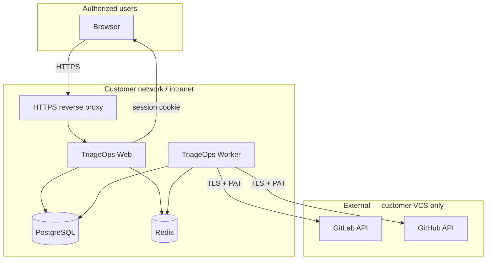

# Security

This document describes how TriageOps handles authentication, credentials, and data — written for **on-prem / intranet** deployments and for security reviewers evaluating the product before rollout.

**Summary:** TriageOps is designed to run **inside your network**. User login is OAuth-based with optional allowlists. VCS personal access tokens (PATs) are stored in your Postgres instance and used server-side only to sync issue metadata. **Production requires explicit hardening** (auth enabled, HTTPS, strong DB passwords, network isolation). Some MVP limitations (plain-text PAT storage) are documented below with mitigations and roadmap.

---

## Security model



| Boundary | What crosses it |
|----------|-----------------|
| User → TriageOps | HTTPS, OAuth login, HTTP-only session cookie |
| TriageOps → VCS | HTTPS only; PAT sent in `Authorization` / `PRIVATE-TOKEN` headers |
| TriageOps → third parties | **No** SaaS telemetry, analytics, or external AI in MVP (Ollama is local, Phase 2) |
| Data residency | All synced issue data stays in **your** Postgres |

---

## Authentication and access control

### Implemented

| Control | Detail |
|---------|--------|
| **Login** | Auth.js v5 — GitHub and/or GitLab OAuth (configurable via `AUTH_PROVIDERS`) |
| **Sessions** | JWT strategy, delivered as **HTTP-only** cookies (not accessible to browser JavaScript) |
| **Route protection** | Next.js `proxy.ts` blocks unauthenticated access to dashboard and `/api/*` |
| **API enforcement** | Route handlers call `requireApiSession()`; unauthenticated requests return **401** |
| **API proxy behaviour** | `proxy.ts` returns JSON **401** / **503** for `/api/*` (not browser redirects) when unauthenticated or setup is incomplete |
| **Allowlist** | `ALLOWED_EMAIL_DOMAINS` / `ALLOWED_EMAILS` — required in production; empty allowlist **refuses web startup** |
| **Deployment profiles** | On-prem: `AUTH_DATA_SCOPE=shared` + GitLab OAuth + allowlist. Hosted solo: `per_user` isolation |
| **Dev bypass** | `AUTH_DISABLED=true` skips all auth — **refused at startup** when `NODE_ENV=production` unless `ALLOW_AUTH_DISABLED=true` (CI only) |

### Instance bootstrap (Phase 4 — shipped)

**Decision doc:** [on-prem-product.md](./on-prem-product.md)

| Control | Detail |
|---------|--------|
| **Setup wizard** | Fresh install → `/setup` → first OAuth login becomes first `ADMIN` |
| **More admins** | Existing admins promote users via Admin UI (no shared recovery password) |
| **Closed registration** | After setup, only admin-provisioned emails may sign in (`ProvisionedUser`) |
| **Allowlist default** | Empty allowlist in production → **startup fails** (configure `ALLOWED_EMAIL_DOMAINS` or `ALLOWED_EMAILS`) |

### Corporate SSO (GitLab)

On-prem customers often use SSO into GitLab (Okta, Azure AD, etc.). TriageOps does **not** integrate with the IdP directly. Users sign in with **GitLab OAuth**; GitLab handles corporate SSO upstream. This is the recommended on-prem login path.

### Not yet implemented

- Direct SAML/OIDC to corporate IdP (bypassing GitLab/GitHub) — Phase 3a deferred
- Unified change log + CSV export — Phase 15
- Impact reporting / metric snapshots — Phase 16
- Write-back rollback / revert — Phase 17
- `ProjectMembership` (per-user project access) — optional Phase 4

### Implemented governance (Phase 4)

| Control | Detail |
|---------|--------|
| **RBAC** | `ADMIN`, `LEAD`, `OPERATOR`, `VIEWER` with API enforcement |
| **Admin UI** | `/admin` overview, users, audit, jobs |
| **Audit log** | `AuditEvent` model + logging on critical actions |
| **Bootstrap** | `/setup`, closed registration, production startup guards |
| **API rate limiting** | Redis-backed limits on `/api/*` — see [Rate limiting](#rate-limiting) |

### Production hardening (June 2026)

Review-driven fixes for on-prem / Gate B readiness:

| Control | Behaviour |
|---------|-----------|
| **Allowlist fail-fast** | On web startup (`instrumentation.ts`), production with auth enabled throws if both `ALLOWED_EMAIL_DOMAINS` and `ALLOWED_EMAILS` are empty — same guard as `TOKEN_ENCRYPTION_KEY` and `AUTH_SECRET`. |
| **JWT lifecycle** | `requireApiSession()` and `getAuthContext()` load `deactivatedAt` from the DB each request; deactivated or deleted users get **401**, not a default role. |
| **`ADMIN_EMAILS` fallback** | Optional env list for scripted installs. Promotes to `ADMIN` only when the user's current role is `VIEWER` — demotions to `LEAD` / `OPERATOR` are not undone on the next sign-in. See [on-prem-product.md](./on-prem-product.md). |
| **Connections API RBAC** | `GET` and `POST /api/connections` require `connections.manage` (**ADMIN** only). PATs are never returned in list responses. |
| **API clients vs browsers** | Middleware (`auth.config.ts` `authorized`): `/api/*` (except `/api/auth/*`) returns JSON `{ error: "Unauthorized" }` (**401**) or `{ error: "Instance setup is not complete" }` (**503**). Dashboard routes still redirect to `/login` or `/setup`. |
| **Redis in prod compose** | `docker-compose.prod.yml` requires `REDIS_PASSWORD`; web and worker use `REDIS_URL=redis://:<password>@redis:6379`. Redis is not exposed on host ports. |
| **Pinned Ollama image** | Product compose pins `ollama/ollama:0.30.10` (dev `docker-compose.yml` may still use `latest`). |

---

## VCS credentials (personal access tokens)

### How PATs are used

1. An authorized user adds a **connection** in the UI with a PAT.
2. The PAT is stored in `vcs_connections.accessToken` in Postgres.
3. Only **server-side** code reads the PAT:
   - Worker sync jobs (issue fetch)
   - Worker write-back jobs (apply suggestions to VCS)
   - Web API `remote-projects` listing
4. PATs are **never** returned in `GET /api/connections` responses.

Login OAuth tokens (Auth.js `accounts` table) are **separate** from sync PATs. Logging in does not grant VCS access without a connection PAT.

### Least-privilege scopes (recommended)

| Provider | Minimum scope for list + sync | Write-back (Apply) |
|----------|------------------------------|---------------------|
| **GitHub** | `repo` (private repos) or `public_repo` (public only) | `repo` or fine-grained **Issues: Read and write** |
| **GitLab** | `read_api` (sync only) | `api` (update description, notes, close issues) |

Use **fine-grained** or **classic** PATs with the narrowest scope your organization allows. Rotate tokens on a schedule and when people leave the team.

### Known limitation: PAT storage at rest

**When `TOKEN_ENCRYPTION_KEY` is set**, new PATs are encrypted with AES-256-GCM (`enc:v1:…` prefix). Legacy plain-text rows remain readable until re-saved. **When the key is unset** (local dev), tokens are stored as plain strings.

Generate a key:

```bash
openssl rand -base64 32
```

Set in `.env`:

```env
TOKEN_ENCRYPTION_KEY=<output>
```

**Mitigations when encryption is off:**

- Run Postgres on a private network segment; no public port exposure
- Restrict database access to web/worker service accounts only
- Encrypt Postgres volumes at the infrastructure layer (LUKS, cloud disk encryption)
- Use short-lived or rotatable PATs with minimal scope
- Limit who can sign in via OAuth allowlist

---

## Application secrets

| Secret | Purpose | Storage |
|--------|---------|---------|
| `AUTH_SECRET` | Signs session JWTs | Environment variable only |
| `AUTH_GITHUB_SECRET` / `AUTH_GITLAB_SECRET` | OAuth client secrets | Environment variable only |
| `DATABASE_URL` | Postgres connection | Environment variable only |
| `REDIS_PASSWORD` / `REDIS_URL` | Job queue (BullMQ + rate limits) | Environment variable only; prod compose requires a password |

- `.env` is **gitignored** (`.env*`); never commit secrets to version control.
- Generate `AUTH_SECRET` with: `openssl rand -base64 32`
- In production, prefer a secrets manager (Kubernetes secrets, Vault, AWS SSM) over plain files on disk.

---

## Rate limiting

API rate limiting protects the web app from request floods and runaway clients **inside** your network. Limits are stored in **Redis** (same instance as BullMQ) so they work across multiple web replicas.

### Behaviour

| Scope | Detail |
|-------|--------|
| **When active** | Enabled by default when `NODE_ENV=production`; disabled in local dev unless `RATE_LIMIT_ENABLED=true` |
| **Identity** | Per authenticated **user ID** on protected API routes; per **client IP** on OAuth (`/api/auth/*`) |
| **Algorithm** | Fixed window counter in Redis; returns **429** with `Retry-After` and `X-RateLimit-*` headers |
| **Redis failure** | Requests are **allowed** (fail-open) with a server log warning — availability over strict blocking |
| **Proxy** | Set `RATE_LIMIT_TRUST_PROXY=true` (default) when HTTPS terminates at nginx/Caddy/Traefik |

### Tier limits (per window)

Each request is checked against a **global** bucket plus a **route tier** bucket when applicable:

| Tier | Typical routes | Default max / 60 s |
|------|----------------|-------------------|
| `default` | All authenticated `/api/*` | 120 |
| `sync` | `POST …/sync` | 10 |
| `analyze` | `POST …/analyze` | 5 |
| `apply` | `PATCH …/suggestions/[id]` | 20 |
| `admin` | `/api/admin/*` | 30 |
| `auth` | `/api/auth/*` (by IP) | 20 |

### Configuration (on-prem)

Set in `.env` on the install host (see [`.env.production.example`](../.env.production.example)). Full variable reference below.

**Increase limits** (busy team, large dashboard): raise `RATE_LIMIT_MAX_REQUESTS` and tier-specific `*_MAX` values.

**Decrease limits** (stricter policy): lower values or shorten the window (e.g. `RATE_LIMIT_SYNC_MAX=3` with `RATE_LIMIT_WINDOW_SECONDS=60`).

**Disable** (locked-down intranet, proxy-only throttling): `RATE_LIMIT_ENABLED=false`.

Restart the **web** container after changes. Worker concurrency (`WORKER_CONCURRENCY`, `LLM_WORKER_CONCURRENCY`) is separate — it limits background jobs, not HTTP requests.

### Environment variables

| Variable | Default | Meaning |
|----------|---------|---------|
| `RATE_LIMIT_ENABLED` | `false` in dev, `true` when `NODE_ENV=production` | Master switch. Set `true`/`false` explicitly to override the default. |
| `RATE_LIMIT_WINDOW_SECONDS` | `60` | Length of each counting window in seconds. All `*_MAX` limits apply **per window**. |
| `RATE_LIMIT_MAX_REQUESTS` | `120` | Global cap on authenticated `/api/*` requests **per user** (any route). |
| `RATE_LIMIT_SYNC_MAX` | `10` | Additional cap on `POST …/sync` **per user** (on top of global). |
| `RATE_LIMIT_ANALYZE_MAX` | `5` | Additional cap on `POST …/analyze` **per user**. |
| `RATE_LIMIT_APPLY_MAX` | `20` | Additional cap on `PATCH …/suggestions/[id]` **per user** (apply or dismiss). |
| `RATE_LIMIT_ADMIN_MAX` | `30` | Additional cap on `/api/admin/*` **per user**. |
| `RATE_LIMIT_AUTH_MAX` | `20` | Cap on `/api/auth/*` **per client IP** (OAuth login/callback). |
| `RATE_LIMIT_TRUST_PROXY` | `true` | When `true`, use `X-Forwarded-For` / `X-Real-IP` for IP-based limits. Set `true` behind nginx, Caddy, or Traefik. |

Each request is checked against the **global** bucket and the **route tier** bucket when applicable — exceeding either returns **429 Too Many Requests**.

Example production block:

```env
RATE_LIMIT_ENABLED=true
RATE_LIMIT_WINDOW_SECONDS=60
RATE_LIMIT_MAX_REQUESTS=120
RATE_LIMIT_SYNC_MAX=10
RATE_LIMIT_ANALYZE_MAX=5
RATE_LIMIT_APPLY_MAX=20
RATE_LIMIT_ADMIN_MAX=30
RATE_LIMIT_AUTH_MAX=20
RATE_LIMIT_TRUST_PROXY=true
```

---

## Air-gapped and self-hosted GitLab

For deployments with **no outbound internet** except internal services:

| Component | Requirement |
|-----------|-------------|
| **GitLab** | Self-hosted GitLab on the customer network; worker sync/write-back uses `baseUrl` + PAT |
| **OAuth login** | Register OAuth app on **self-hosted GitLab**; set `AUTH_GITLAB_ISSUER=https://gitlab.company.internal` |
| **GitHub** | Not usable without reachability to `github.com` — GitLab-only for fully air-gapped installs |
| **Ollama** | Run on the same network; pull models once on a connected maintenance window or mirror images |
| **TriageOps** | No telemetry or external AI — all issue data stays in customer Postgres |

Corporate IdP (Okta, Azure AD) integrates **via GitLab SSO upstream** — TriageOps does not call the IdP directly.

---

## Data stored locally

| Data | Location | Sensitivity |
|------|----------|-------------|
| Issue title, state, assignee, dates, milestone | Postgres | Business metadata — usually low/medium |
| Issue descriptions | Postgres | May contain internal details — treat DB as confidential |
| VCS PATs | Postgres | **High** — protect database access |
| OAuth session/account rows | Postgres | Medium |
| Sync job metadata | Postgres + Redis | Low |

Synced data is a **cache** of VCS issue metadata for triage metrics. Deleting a project or connection removes associated rows (cascade).

**Not sent to external AI:** Ollama runs locally against DB copies only; VCS tokens are never sent to Ollama.

**VCS writes on Apply:** When a user applies a suggestion, the worker uses the stored PAT to update issue bodies, add comments, or close duplicates on GitHub/GitLab. Failed writes are recorded in `IssueSuggestion.writeBackError`.

---

## Network and infrastructure hardening

### Production checklist

Use this before exposing TriageOps beyond a single developer machine:

#### Required

- [ ] `AUTH_DISABLED=false`
- [ ] `AUTH_SECRET` set to a strong random value (≥ 32 bytes)
- [ ] `AUTH_URL` set to your public HTTPS URL (e.g. `https://triageops.company.internal`)
- [ ] OAuth apps registered with HTTPS callback URLs only
- [ ] **HTTPS termination** via reverse proxy (nginx, Caddy, Traefik, load balancer)
- [ ] `ALLOWED_EMAIL_DOMAINS` or `ALLOWED_EMAILS` set for on-prem (if not using other network controls)
- [ ] Change default Postgres password in `.env` (`POSTGRES_PASSWORD`; Compose substitutes into all services)
- [ ] Do **not** expose Postgres (`5433`) or Redis (`6379`) to the internet or guest Wi‑Fi

#### Strongly recommended

- [ ] `TOKEN_ENCRYPTION_KEY` set (encrypt VCS PATs at rest)
- [ ] `RATE_LIMIT_ENABLED=true` (default in production) with limits tuned for your team size
- [ ] Place web + worker + Postgres + Redis on an internal VLAN / private subnet
- [ ] Firewall: only HTTPS (443) to the reverse proxy from allowed client networks
- [ ] Redis: bind to internal network only; add `requirepass` if Redis is shared
- [ ] Regular OS and container image updates
- [ ] Encrypted backups of Postgres; restrict backup access
- [ ] Document PAT owners and rotation policy

#### Optional / enterprise

- [ ] mTLS between services
- [ ] Centralized logging (web + worker stdout → SIEM)
- [ ] Postgres encryption at rest (platform-level)
- [ ] Separate DB role per service with least privilege

### Default Docker Compose (development)

The bundled `docker-compose.yml` falls back to **default passwords** (`triage_ops`) when `POSTGRES_PASSWORD` is unset in `.env`, and **published ports** for local dev. Set `POSTGRES_PASSWORD` in `.env` for production — Compose substitutes it into Postgres, web, worker, and migrate.

---

## On-prem reference configuration

For a full step-by-step install checklist (Docker Compose, OAuth, HTTPS, acceptance tests), see **[Intranet Rollout](./intranet-rollout.md)**. Kubernetes deployments via Helm are planned (Phase 3c) but not available yet.

**Product install (no git clone):** planned for end of Phase 4 — [on-prem-product.md](./on-prem-product.md).

Example `.env` for an intranet GitLab deployment:

```env
AUTH_DISABLED=false
AUTH_SECRET=<openssl rand -base64 32>
AUTH_URL=https://triageops.company.internal
AUTH_PROVIDERS=gitlab
AUTH_DATA_SCOPE=shared

ALLOWED_EMAIL_DOMAINS=company.com

AUTH_GITLAB_ID=<oauth-app-id>
AUTH_GITLAB_SECRET=<oauth-app-secret>
AUTH_GITLAB_ISSUER=https://gitlab.company.internal

POSTGRES_USER=triage_ops
POSTGRES_PASSWORD=<strong-password>
POSTGRES_DB=triage_ops

REDIS_PASSWORD=<strong-password>
REDIS_URL=redis://:<strong-password>@redis:6379
TOKEN_ENCRYPTION_KEY=<openssl rand -base64 32>
NODE_ENV=production
```

Register the GitLab OAuth application with redirect URI:

`https://triageops.company.internal/api/auth/callback/gitlab`

---

## Security testing

| Check | How to verify |
|-------|----------------|
| Unauthenticated API blocked | `curl -i http://localhost:3000/api/projects` → **401** JSON (with `AUTH_DISABLED=false`) |
| Setup-incomplete API blocked | Before `/setup` completes, `curl -i http://localhost:3000/api/projects` → **503** JSON (not a redirect) |
| Connections list RBAC | `GET /api/connections` as `VIEWER` → **403**; as `ADMIN` → **200** (no `accessToken` in body) |
| PAT not in API responses | `GET /api/connections` JSON has no `accessToken` field |
| Allowlist works | Sign in with email outside `ALLOWED_EMAIL_DOMAINS` → access denied |
| Rate limit works | Repeat `POST /api/projects/[id]/sync` rapidly → **429** when over `RATE_LIMIT_SYNC_MAX` |
| Unit tests | `npm run test -w @triage-ops/web` includes auth, session, and rate-limit tests |

---

## FAQ for security reviewers

**Does user data leave our network?**  
Synced issue metadata is stored in your Postgres. The worker calls **your** GitHub/GitLab instance over HTTPS. No TriageOps cloud service receives data in on-prem mode.

**Who can access the dashboard?**  
Users who pass OAuth login and (if configured) the email/domain allowlist. After setup, **new** users must be admin-provisioned (closed registration). If `ALLOWED_EMAIL_DOMAINS` and `ALLOWED_EMAILS` are both empty in production, the web app **refuses to start** — configure at least one before deploying.

**How are passwords stored?**  
There are no local passwords. Authentication is OAuth-only.

**Can we use our corporate IdP?**  
Indirectly via GitLab (or GitHub) OAuth. Direct SAML/OIDC to the IdP is not implemented in the current release.

**What does `ADMIN_EMAILS` do?**  
Optional automation fallback for first install or scripted ops. On sign-in, matching emails are promoted to `ADMIN` only if their current role is `VIEWER`. Admins who demote someone to `LEAD` or `OPERATOR` will not see that user re-promoted on the next login. Primary path for admins is the setup wizard and Admin → Users.

**Is the app safe on the public internet?**  
It can be, with HTTPS, auth, allowlists, and hardened infrastructure — but the product is **optimized for intranet on-prem**. Weigh network exposure and operational hardening (Redis password, allowlist, encrypted PATs) before internet-facing deployment.

**What happens if someone deletes a connection?**  
Cascade delete removes projects, issues, and sync history for that connection. PAT is removed from the database.

---

## Roadmap (security-related)

| Item | Status |
|------|--------|
| OAuth login + proxy protection | Shipped |
| Email/domain allowlist | Shipped |
| Encrypt `accessToken` at rest | Shipped (Phase 3a) — set `TOKEN_ENCRYPTION_KEY` in production |
| Per-project auto-sync | Shipped (Phase 3b) — `AUTO_SYNC_SCHEDULER_ENABLED` on worker |
| Webhook-triggered sync | Planned (Phase 3b) |
| RBAC (admin / operator / viewer) | Shipped (Phase 4) — four roles, API enforcement |
| Audit log + admin dashboard | Shipped (Phase 4) — `/admin`, `/admin/audit`, `/admin/jobs` |
| Write-back rollback | Open (Phase 17) — not implemented |
| Enterprise SSO (direct IdP) | Planned (Phase 3) |
| API rate limiting | Shipped (Phase 3a) — Redis-backed; configure via `RATE_LIMIT_*` env vars |
| LLM isolation (no token leakage to Ollama) | Shipped |
| VCS write-back on Apply (worker PAT usage) | Shipped (Phase 2.5) |

---

## Reporting issues

If you discover a security vulnerability in this repository, report it privately to the maintainers rather than opening a public issue with exploit details.
